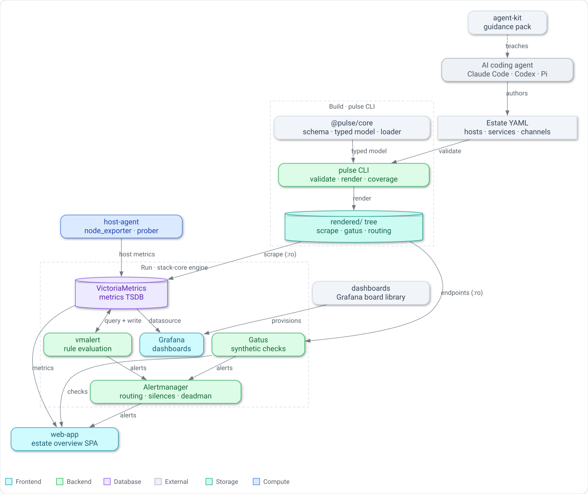

# Pulse

> Declarative, agent-operable monitoring for your homelab — describe your estate in one YAML file, and Pulse renders and runs the whole stack.

[](https://github.com/garygentry/pulse/actions)
[](https://bun.sh)
[](https://www.typescriptlang.org/)
[](#license)

Pulse turns a single declarative description of your infrastructure — an *estate* of hosts, services, channels, and what's deliberately unmonitored — into a complete, self-hosted monitoring stack.
You edit one YAML file and re-render; you never touch a host to change what is monitored.
The engine that runs it all is estate-agnostic by construction: no host, domain, or credential literal ships in the committed tree, so a clean checkout boots green against a seeded fixture with nothing to fill in first.

Pulse is also built to be operated by an AI coding agent.
Every command speaks a `0` / `1` / `2` exit contract and a machine-readable `--json` envelope, the loader reports findings with a file, field, and fix path, and a generated guidance pack teaches Claude Code, Codex, and Pi how to author and validate an estate.

## Architecture

<picture>
  <source media="(prefers-color-scheme: dark)" srcset="assets/architecture.dark.svg" />
  <source media="(prefers-color-scheme: light)" srcset="assets/architecture.light.svg" />
  
</picture>

The estate flows one way: you declare it, `pulse render` materializes it into a read-only config tree, and the stack-core engine mounts that tree to run the monitoring services.
Everything estate-specific enters through exactly two seams — the rendered tree and `${VAR}` secret references — and nothing else.

## Features

- **Estate-as-code.** One declarative `estate.yaml` is the single source of truth for hosts, services, channels, routing, and rationale-bearing suppressions.
- **Estate-agnostic engine.** The committed stack encodes *structure*, never *whose* estate it monitors; the same tree boots green from a fictional fixture and runs a real estate unchanged.
- **Deterministic rendering.** `pulse render` is pure — no clock, host, PID, or random content — so the committed golden trees reproduce byte-for-byte and `render --check` is an exact drift gate.
- **Agent-friendly contract.** A `0` / `1` / `2` exit convention, a single `--json` envelope per command, and findings located to file/field/fix make the CLI safe to drive programmatically.
- **Secrets as references, never values.** Guidance and config carry only `${ENV}` and `op://` references; a generation-time lint fails the build on any secret literal.
- **Agent-operable.** `@pulse/agent-kit` generates a guidance pack — runnable skills and subagents — that teaches Claude Code, Codex, and Pi to operate an estate.

## Requirements

- [Bun](https://bun.sh) `>= 1.3` — the toolchain and test runner for every package.
- [Docker](https://docs.docker.com/get-docker/) with Compose — required only to bring the monitoring stack up; the TypeScript packages and tests run without it.

## Install

Pulse is a Bun monorepo; clone it and install once from the root.

```sh
git clone git@github.com:garygentry/pulse.git
cd pulse
bun install
```

## Quickstart

### 1. Validate and render an estate

Two complete example estates ship under [`examples/`](examples/).
The CLI resolves its config relative to the working directory, so run it from inside a fixture.

```sh
cd examples/minimal

bun run ../../apps/cli/src/index.ts validate   # schema-validate the estate — exit 0 = clean
bun run ../../apps/cli/src/index.ts coverage   # every host monitored or suppressed — exit 0 = no gaps
bun run ../../apps/cli/src/index.ts render      # (re)write the rendered/ config tree in place
```

Each verb keys off the exit contract: `0` = success, `1` = findings or drift, `2` = a tool fault.
Add `--json` to any verb to get the single machine-readable envelope instead of prose.

### 2. Bring the monitoring stack up

The engine takes one input: a rendered directory, mounted read-only.
Use the seeded fixture that ships with the stack to see it live immediately.

```sh
cd stack/compose
cp .env.example .env          # .env is git-ignored — never commit it

PULSE_RENDERED_DIR=../tests/fixtures/rendered \
  docker compose up --wait --wait-timeout 180
```

`--wait` returns `0` only once every default-profile service is healthy: VictoriaMetrics, vmalert, Alertmanager, Gatus, Grafana, cAdvisor, and the Proxmox exporter.
Tear it down, removing volumes:

```sh
docker compose down -v --remove-orphans
```

## What's inside

Pulse is a monorepo of focused packages and a Docker Compose engine.
Each has its own architecture document under [`docs/architecture/`](docs/architecture/).

| Path | Package | Role |
|------|---------|------|
| [`packages/core`](packages/core) | `@pulse/core` | The estate schema, typed in-memory model, and the loader that turns consumer YAML into that model or precisely-located findings — the seam everything else builds against. |
| [`packages/renderer`](packages/renderer) | `@pulse/renderer` | The deterministic rendering engine and the CLI init-seam (the guidance-pack contract). |
| [`apps/cli`](apps/cli) | `@pulse/cli` | The `pulse` binary: `init`, `render`, `validate`, `coverage`, with the `0/1/2` + `--json` contract. |
| [`stack/`](stack) | — | **stack-core** — the Docker Compose engine (VictoriaMetrics, vmalert, Alertmanager, Gatus, Grafana, exporters), plus the `alerting` rule library and `grafana` dashboard mount points. |
| [`agent/`](agent) | — | **host-agent** — `node_exporter`, optional cAdvisor, a heartbeat exporter, and one central deep-health prober, with pinned images and a recorded metric contract. |
| [`apps/web`](apps/web) | `@pulse/web` | The estate-overview SPA: a `Bun.serve` server that aggregates the engine sources into one snapshot, and a React UI (Tailwind CSS v4, the vendored `@/ui` library) that paints the estate views. |
| [`agent-kit`](agent-kit) | `@pulse/agent-kit` | Generates the agent-facing guidance pack (Claude Code, Codex, Pi) from a single authored source, contract-checked against the live schema, CLI, and severity taxonomy. |
| [`apps/docs`](apps/docs) | `@pulse/docs` | An Astro docs site synced from `docs/architecture/`. |
| [`examples/`](examples) | — | Two self-contained estate fixtures (`minimal`, `reference`) with committed golden render trees. |

## How it works

- **You declare an estate.** `estate.yaml` names your hosts and their collection class, the services to watch, where alerts route, and what is deliberately suppressed and why.
- **`@pulse/core` validates it.** The loader produces either a typed model or a list of findings, each pinned to a file, field, and fix path — nothing downstream re-parses raw YAML.
- **`pulse render` materializes it.** The estate becomes a read-only tree of scrape targets, Gatus endpoints, and abstract routing — the committed golden output the stack consumes.
- **stack-core runs it.** The Compose engine mounts subtrees of the rendered directory into the services that need them, always read-only, and boots green.
- **The web app and dashboards surface it.** `@pulse/web` aggregates VictoriaMetrics, Alertmanager, and Gatus into one live overview; the Grafana board library provisions estate-agnostic dashboards.
- **An agent can drive all of it.** The `agent-kit` guidance pack, laid down create-only by `pulse init`, teaches an AI coding agent the vocabulary, the CLI contract, and the runnable skills to author and validate an estate.

## Development

Everything runs through Bun from the repo root.

```sh
bun run typecheck     # tsc -b across every package
bun test              # the full test suite (contracts, goldens, drift, smoke)
bun run ci            # typecheck → test → docs build (the exact CI gate)
```

Per-area smoke suites are available individually — for example:

```sh
bun run smoke:cli            # the pulse CLI smoke suite
bun run smoke:stack          # the Docker bring-up smoke tier (self-skips with no daemon)
bun run smoke                # every smoke suite in sequence
```

The `reference/` example tree is the canonical golden corpus.
After an intentional estate or renderer change, regenerate goldens with `bun run golden:update`, then review `git diff examples/**/rendered/` before committing — regenerating a golden is a deliberate, reviewed act, never automatic.

## Documentation

- [`docs/operator/`](docs/operator/) — task-oriented operator guides: [getting started](docs/operator/getting-started.md), [exposure](docs/operator/exposure.md), [alerting](docs/operator/alerting.md), and the [web overview](docs/operator/web-overview.md), plus recipes for secrets, sizing, and the command-exporter.
- [`docs/runbooks/`](docs/runbooks/) — step-by-step operational runbooks: [bootstrap](docs/runbooks/bootstrap.md), [agent install](docs/runbooks/agent-install.md), [backup enrollment](docs/runbooks/backup-enrollment.md), and the retirement checklist.
- [`docs/architecture/`](docs/architecture/) — a developer-focused architecture document per component (overview, design, API reference, and integration guide).
- [`examples/`](examples/) — annotated estate fixtures, from the smallest valid estate to one exercising every schema surface.
- `bun run docs:build` — build the Astro documentation site under [`apps/docs`](apps/docs), which surfaces all of the above behind one sidebar (Operator / Runbooks / Architecture).

## License

Pulse is currently **private and proprietary — all rights reserved**.
No open-source `LICENSE` is distributed with this repository; contact the maintainer for usage or contribution terms.
