# Architecture

agent-kit is a build-time generator with one job: turn a single authored source into the native
guidance files of several agent ecosystems, provably free of drift. Its architecture is the pipeline
that does this — a content model, a bundle of contract-checked data slots, a registry of per-ecosystem
emitters, a deterministic generation step, and a drift check that guards the committed output. This
document walks each stage and the boundaries between them.

## The single-source pipeline

```mermaid
graph TD
  subgraph source["src/content/** (authored once)"]
    U[Manifest: ordered ContentUnit&#91;&#93;]
  end
  subgraph slots["src/slots/** (contract-checked)"]
    S1[inventoryVocab<br/>← @pulse/core Zod schema]
    S2[cliContract<br/>← real pulse CLI]
    S3[severity<br/>← @pulse/alerting JSON]
  end

  U --> R{{"unit.render(slots)"}}
  S1 & S2 & S3 --> R
  R --> E[emitter registry<br/>claude · codex · pi · generic]
  E --> L[secret-lint every file]
  L --> G[generated/&lt;ecosystem&gt;/**<br/>committed]
  G --> P[guidance-pack.generated.ts<br/>GUIDANCE_PACK + PACK_BYTES]
  P -. release build .-> CLI[pulse init scaffolds<br/>create-only]

  G -. verify:generated .-> D[byte-compare vs fresh render<br/>drift = build failure]
```

The flow is strictly one-directional and pure: the only inputs are the manifest and the slots, so an
identical `(manifest, slots)` yields byte-identical output. That purity is what makes the drift check
meaningful — a non-empty diff can *only* mean a hand-edit or an un-regenerated source change.

## The content model

Content is authored as typed objects, never templates. The core types live in `src/emit/types.ts`.

- **`ContentUnit`** — one ecosystem-agnostic unit. It carries a stable kebab-case `id` (also the
  generated file stem), a `kind` (`guidance` / `skill` / `subagent`), runnable `frontmatter`
  (`name` / `description` / optional `argumentHint`), the `targets` ecosystems, the `requirements`
  ids it satisfies, and a `render(slots): Section[]` function.
- **`Section` / `CodeBlock`** — a unit's body is an ordered list of sections (heading + prose + optional
  fenced code). Sections are composed into a file by plain, deterministic string composition through
  one shared markdown module (`src/emit/markdown.ts`) — no template engine, `\n` line endings only.
- **`Manifest`** — the ordered `ContentUnit[]`. Order is significant: guidance → skills → subagents,
  and within a group authored order fixes generated iteration order for determinism.

`src/content/manifest.ts` assembles the nine authored units and enforces a v1 invariant in
`loadManifest()`: **every unit must target exactly the first-class set** (`claude`, `codex`, `pi`).
A unit with any other `targets` fails the build via `ContentValidationError` rather than silently
under-emitting. The `generic` output is derived by the generic emitter from those same units — not by
adding `"generic"` to a unit's `targets`.

The `kind` governs routing and whether runnable frontmatter is required:

| `kind` | Where it routes | Runnable frontmatter? |
|--------|-----------------|-----------------------|
| `guidance` | root primer + docs (`CLAUDE.md`, `.claude/docs/`, `AGENTS.md`, `.pi/guidance/`) | no |
| `skill` | skills dir (`.claude/skills/<id>/SKILL.md`, `.pi/skills/`, Codex playbook) | yes (Claude/Pi) |
| `subagent` | agents dir (`.claude/agents/<id>.md`, `.pi/agents/`, Codex playbook) | yes (Claude/Pi) |

## The three contract-checked slots

Every `render()` receives a `Slots` bundle assembled by `buildSlots()` (`src/slots/index.ts`). Each
slot is *derived and locked* against an upstream source of truth, so the guidance cannot teach stale
facts. This is the single most important design idea in the package.

### `inventoryVocab` — locked to the Zod schema

`src/slots/inventory-vocab.ts` introspects `@pulse/core`'s `inventorySchema` to derive three checked
enumerations: the schema major version (`CURRENT_SCHEMA_MAJOR`), the top-level section keys (in
schema-declared order), and the host collection classes (from the `hosts` discriminated union,
sorted). This module is the **only** place Zod-object-shape coupling lives; every shape assumption
throws `SlotMismatchError` rather than deriving a wrong vocabulary, so a Zod major bump or an upstream
schema restructuring fails loud here. Only the per-section teaching `summary` prose is authored
(`VOCAB_SUMMARIES`); a schema section shipped upstream without a matching summary is treated as genuine
drift and fails the build. The `inventory-contract.test.ts` suite asserts the shipped content against
these same derived enumerations.

### `cliContract` — locked to the real CLI

`src/slots/cli-contract.ts` authors a typed `CliContract` table: for each `pulse` verb (`init`,
`render`, `validate`, `coverage`), its summary, its `0/1/2` exit-code cases, and its `--json` envelope
`data` field names, plus the top-level `PulseEnvelope` fields an agent parses. `cli-contract.test.ts`
drives the **real** CLI in-process (`runCli`) to each condition and asserts every claim, so a drift in
the CLI's verb set, exit codes, or envelope shape fails the build.

### `severity` — locked to alerting's published artifact

`src/slots/severity.ts` reads `@pulse/alerting`'s published `severity-taxonomy.json` **by path** and
adapts its nested shape into the flat `SeverityDef[]` the content renders from. agent-kit takes **no**
runtime or type dependency on `@pulse/alerting` (it sits outside the root `workspaces` globs); the
`SeverityDef` type is a sanctioned local mirror (the OT-02 fallback — a composite/no-emit project
reference is impossible), and `severity-contract.test.ts` locks the shipped content against the real
artifact so the mirror can introduce no silent divergence. Order (critical → warning → info) is
preserved from the artifact and is significant. Note `deadman` is deliberately **not** a routable
severity — it is a liveness mechanism, and the content teaches agents not to classify an alert as
`deadman`.

## The emitter registry

Each ecosystem has one `Emitter` (`emit(manifest, slots): EmittedFile[]`), registered in
`src/emit/registry.ts`. The `Record<Ecosystem, Emitter>` type makes adding an `Ecosystem` a compile
error until its emitter is registered — additive-by-construction, no silent gap. All emitters consume
the one manifest; that is the single-source guarantee.

| Emitter | Layout | Runnable? |
|---------|--------|-----------|
| `claude` (`emit/claude.ts`) | `vocab-primer` → root `CLAUDE.md`; other guidance → `.claude/docs/<id>.md`; skills → `.claude/skills/<id>/SKILL.md`; subagents → `.claude/agents/<id>.md` | yes — the **reference** ecosystem (live eval) |
| `codex` (`emit/codex.ts`) | one `AGENTS.md` (all guidance + a Playbooks index) plus `skills/NN-<id>.md` playbooks (Codex has no skill runtime) | no — skills degrade to instruction prose |
| `pi` (`emit/pi.ts`) | `.pi/guidance/<id>.md`, `.pi/skills/<id>.md`, `.pi/agents/<id>.md` | yes — the concrete paths/keys are the OT-01 provisional mapping (see note) |
| `generic` (`emit/generic.ts`) | one best-effort `AGENTS.md` with a disclaimer; all units folded in | no — untested, excluded from the pack |

Every emitter skips units that do not target its ecosystem, stamps a `GENERATED … DO NOT hand-edit`
banner on each file, and throws `ContentValidationError` on a unit whose rendered body is empty. Two
shared helpers keep composition identical across ecosystems: `renderSections` (markdown composition)
and `renderFrontmatter` (fixed-key-order YAML for runnable skills/subagents).

> **Pi mapping caveat.** The Pi emitter's directory constants (`.pi/guidance`, `.pi/skills`,
> `.pi/agents`) and frontmatter key spelling are the OT-01 provisional mapping and have **not** been
> confirmed against a live Pi runtime. The *strategy* (route by `ContentKind`, deliver skills in
> runnable form) is fixed; if Pi's live format differs, only those constants and the path builders
> change.

## Generation, secret-lint, and drift

**`scripts/generate.ts`** is the deliberate, reviewed regeneration act. For each ecosystem in
`ECOSYSTEMS` order it cleans the ecosystem tree (so a removed unit cannot leave a stale file behind),
runs the emitter, lints every file for secret literals, and writes it under `generated/<ecosystem>/`.
It then writes `generated/guidance-pack.generated.ts` from the freshly written tree.

**`emit/secret-lint.ts`** enforces REQ-SEC-01: shipped guidance must teach secret *references* only
(`${ENV}` / `op://` grammar), never literals. `assertNoSecretLiterals` runs on every emitted file
before it is written; a secret-suggesting assignment that is not a sanctioned reference throws
`SecretLiteralError` and fails generation.

**`scripts/verify-generated.ts`** is the drift guard. `verifyGenerated()` regenerates the whole tree
into a fresh temp dir and byte-compares against the committed `generated/`, returning `DriftFinding[]`
(`missing` / `unexpected` / `changed`, with a first-diff excerpt). Empty means in sync; non-empty
means a hand-edit or an un-regenerated source change. The gating `generated-drift.test.ts` wraps these
helpers, and the CLI entry point exits non-zero with the offending paths.

## The error model

Generation and emit follow the repo's stated-throws pattern — a broken source fails the build loudly,
never emits degraded content. All errors extend `AgentKitError` and carry a stable machine-readable
`code` (`src/emit/errors.ts`):

| Error | `code` | Thrown when |
|-------|--------|-------------|
| `ContentValidationError` | `CONTENT_INVALID` | a malformed unit — bad id, a `requirements` entry failing `REQ_ID_RE`, wrong `targets`, or an empty rendered body |
| `UnknownEcosystemError` | `UNKNOWN_ECOSYSTEM` | a unit targets an ecosystem with no registered emitter |
| `SlotMismatchError` | `SLOT_MISMATCH` | a slot's upstream shape changed (schema/CLI/taxonomy drift) |
| `SecretLiteralError` | `SECRET_LITERAL` | an emitted file contains a non-reference secret literal |

## The CLI init seam

The pack is a **declarative** value — `GuidancePack` from `@pulse/renderer` — a stable `id` plus a
list of `GuidancePackFile`s, each `{ source, target, merge: "create-only" }`. `buildGuidancePack()`
assembles it from the committed **first-class** `generated/**` trees only (`generic` is emitted but
never packed), in a stable order (first-class ecosystem order, then sorted paths).

`generated/guidance-pack.generated.ts` is the committed data module: `GUIDANCE_PACK` (the pack) plus
`PACK_BYTES` (each `source` key → its literal file contents). It is deterministic — keys sorted, values
`JSON.stringify`-escaped.

At **release build**, `apps/cli/scripts/build-bin.ts` rewrites `apps/cli/src/commands/init.ts` to
import `GUIDANCE_PACK` / `PACK_BYTES` from `agent-kit/generated/guidance-pack.generated.js`, so the
pack is embedded in the compiled binary and `pulse init` lays the guidance files down create-only
after the base scaffold. The wire-in uses a **relative** specifier so no `@pulse/agent-kit` entry is
added to the CLI's `package.json` — the committed dependency graph stays acyclic (only
`agent-kit → @pulse/cli`); the reverse `apps/cli → agent-kit` edge exists only transiently in the
rewritten source during a release. With no pack present, `init` still emits the base scaffold and
succeeds.

## Determinism as a contract

Determinism is not incidental — several requirements depend on it and the drift check enforces it:

- Emitters are pure; identical inputs give byte-identical `EmittedFile[]`.
- Manifest and ecosystem iteration orders are fixed and significant.
- No clock, host, PID, or random content is ever emitted; markdown composition is a single shared,
  pure module; frontmatter keys have a fixed order.
- The pack module sorts its keys and escapes every value.

Any violation surfaces as a drift finding or a failed contract test, not as silent divergence.

## Testing

The suite gates the single-source guarantee from several angles (see the
[API Reference](./api-reference.md#scripts-and-tests) for the full list): the three **contract locks**
(inventory / CLI / severity) assert the content against live upstreams; **`generated-drift.test.ts`**
guards the committed tree; **`pack-scaffold.test.ts`** proves create-only scaffolding and non-escaping
paths; **`requirements-coverage.test.ts`** is a traceability meta-guard over each unit's
`requirements[]`; **`error-surface.test.ts`** pins the throw behavior. The **eval** tier has three
levels: a per-PR **deterministic** eval (scripted fixture mutations driving the real CLI — no model),
an opt-in **live** Claude Code eval (the reference-ecosystem release gate, self-skipping without a
credential), and a **smoke** eval asserting the Codex/Pi packs are present, non-empty, and well-formed.
