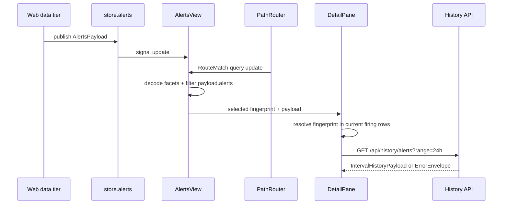

# Architecture

Alert Triage is a lazy React view layered on the web foundation’s path router, signal store, the shared `@/ui` component library (see [Web UI](../ui.md)), and web-data wire contracts. The browser performs presentation-only derivation over a single folded alerts payload. Only the detail history strip makes an additional request.

## System Overview

```mermaid
graph LR
  AM[Alertmanager] --> DT[web data tier]
  VM[vmalert] --> DT
  DT --> API[/api/alerts]
  API --> STORE[store.alerts signal]
  ROUTER[PathRouter] --> VIEW[AlertsView]
  STORE --> VIEW
  VIEW --> FACETS[Facet predicate]
  FACETS --> TABLE[Virtualized triage table]
  VIEW --> CATALOG[Rule catalog]
  VIEW --> SILENCES[Active silences]
  VIEW --> DRAWER[Detail sheet]
  DRAWER --> HISTORY[/api/history/alerts]
  DRAWER --> ACTIONS[Capability-gated action slots]
```

The server data tier owns source clients, validation, deterministic ordering, and payload publication. The view never contacts Alertmanager or vmalert directly and never resorts the supplied arrays.

## View Composition

`views/registry.ts` registers `alerts` as a lazy view with navigation order 1. The registry loader imports `views/alerts/view.tsx` and uses its default export. The entry also declares one deep route, `routes: ["/alerts/:fingerprint"]`, so links of the form `/alerts/<fingerprint>` (emitted by the overview firing ribbon and the command palette) resolve to this view instead of falling back to `/`.

`AlertsView` adds a render error boundary around `AlertsViewBody`. A descendant error produces an inline error card and leaves the application shell operational.

`AlertsViewBody` coordinates four state sources:

- `router.current()` and `router.subscribe()` for tabs, facets, and selection;
- `store.alerts` for the folded `AlertsPayload`;
- a local `selectedIndex` signal for keyboard movement;
- the shared `store.session` signal for future action capabilities.

The component subscribes to router changes on mount and disposes the subscription on unmount. Every navigation mutation starts from the current query, preserving unrelated keys and shell-carried kiosk/rotation state.

## Data Flow



### Payload boundary

`readAlerts(store)` is the only narrowing boundary from the generic store signal to `AlertsPayload | null`. The data tier has already validated the wire shape. The alert view does not perform a second schema-validation pass.

The selectors preserve upstream ordering:

- `firingRows()` returns `payload.alerts` by reference;
- `rules()` and `silences()` return their arrays unchanged;
- `ruleFamily()` uses the first catalog rule with a matching name;
- `relatedByTarget()` uses exact `{ kind, id }` equality.

A rule name without a catalog match belongs to the synthetic `ungrouped` family.

### Facet semantics

The five facets are severity, state, group, host/service, and rule family. `matchesFacets()` implements:

- union within a facet: any selected value may match;
- intersection across facets: every active facet must match;
- empty facet selection: no constraint;
- null alert values: cannot satisfy an active facet.

Facet controls operate over the current payload only. Changing a facet never triggers network I/O.

## URL State

`url-state.ts` is the sole codec between `RouteMatch.query` and typed triage state.

| State | Query key | Encoding |
|---|---|---|
| Severity | `sev` | comma-separated sorted values |
| Alertmanager state | `state` | comma-separated sorted values |
| Group | `group` | comma-separated sorted values |
| Host/service | `hs` | `kind:id`, comma-separated |
| Rule family | `family` | comma-separated sorted values |
| Selected alert | `sel` | Alertmanager fingerprint |
| Active tab | `tab` | omitted for firing; `catalog` or `silences` otherwise |

Two **inbound-only** forms are also accepted, for links built outside the view:

| Inbound form | Decoded as |
|---|---|
| `/alerts/<fingerprint>` (path) | the selection, when `sel` is absent (`sel` wins when both are present) |
| `?target=<TargetIdentity id>` | the host/service facet value(s) for that id, merged with any `hs` values: only the kind(s) present in the current payload, or `host:`/`service:`/`endpoint:<id>` when none match or no payload is loaded |

`decodeTriageRoute(match, available)` is the single decoder for the full route (path params plus query). The view never emits either inbound form. On the first interaction, `navigateQuery` folds a path fingerprint into `sel` and a `target` alias into canonical `hs`, then navigates to `/alerts?…`. The link therefore settles on the canonical encoding, and closing the detail sheet really closes it. `FacetBar` renders any selected value that is missing from the payload as a pressed chip, so a filter from a hand-typed link, or for a target with no current alerts, is always visible and clearable. When alerts are firing but the active facets exclude all of them, the table says "No alerts match these filters" rather than the all-clear. A `target` alias is left in the URL until the payload has loaded, so it is pruned to the matching kind before being folded into `hs`.

Canonical value sorting means equivalent facet selections produce the same link. Unknown values decode safely and normally match no rows. A literal comma in a facet value is not representable in the current codec.

Selection is intentionally a fingerprint because it identifies the current firing row. If the fingerprint resolves to no current alert, the detail sheet remains open and explains that the alert is no longer firing. This handles resolution and fingerprint churn without a blank or crashing pane.

## Triage Table and Keyboard Flow

The table is the `@/ui` `DataTable` with its opt-in `virtualize` prop, using the library defaults for the compact row height (`DATA_TABLE_VIRTUALIZE_DEFAULTS`) and the 300-row virtualization threshold. Each row’s alert name is a real button carrying `data-triage-open=<fingerprint>`. The table container handles row opening with one delegated click listener.

Keyboard navigation uses the shared shortcut registry:

1. `J` or `K` clamps the cursor to the filtered row range.
2. The handler finds the row-open button by fingerprint rather than rendered index.
3. If virtualization has removed the row from the DOM, it calls the `DataTable` handle's `scrollToIndex` to render the row and retries on the next animation frame.
4. The focused button receives the sole `aria-current="true"` marker.
5. `Enter` opens the selected alert unless focus is already on an interactive control.
6. `Escape` closes an open detail sheet.

`J`, `K`, and `Enter` are inactive outside the Firing tab so they do not conflict with tab navigation.

## Detail Composition

`DetailPane` is a pure function of the current payload and URL selection. It owns no independent open state. For a current alert it renders, in order:

1. labels and annotations, with unsafe links reduced to plain text;
2. routing intent and actual receiver reconciliation;
3. matching active silences;
4. firing history;
5. related firing alerts on the exact rendered target;
6. stable action-slot regions.

The pane renders inside the `@/ui` `Sheet` (Radix Dialog), which owns focus trapping. Because the Sheet is opened from the URL rather than a trigger, `DetailPane` returns focus to the row that opened it on close.

### Routing explanation

The feature carries a typed in-code mirror of the repository severity taxonomy. A drift test compares it with the source JSON. `explainRouting()` returns a total `RoutingIntent`: unknown severity strings produce `matched: false` and null policy fields rather than guessing.

The routing section distinguishes intended channels from `ActiveAlert.receivers`. The browser does not evaluate or mutate Alertmanager routing configuration.

### History state machine

`History` has four states: `loading`, `ready`, `error`, and `no-ref`. It requests history only when the selected alert has a history reference and keys the effect on stable reference primitives, preventing refetches on routine store cycles.

The component deliberately uses `globalThis.fetch` instead of the generic `apiFetch`. It must discriminate a successful `IntervalHistoryPayload` from a JSON `ErrorEnvelope`, including non-2xx overflow responses.

Lane ownership is derived from the canonical tuple `(alertname, severity, host, service, instance)`, with exact target identity as an additional disambiguator when both sides provide it. It never uses the Alertmanager fingerprint for historical attribution. Lanes are ordered as own, matched, then unmatched; no returned lane is truncated.

The timeline domain prefers `fetchedAt - range` through `fetchedAt`. A drift test pins the client’s millisecond map to the server-side range table.

## Degradation and Failure Containment

The view follows a never-silent-green policy:

- source banners use `DataAvailability.state`, never array length;
- each non-current source is named independently;
- stale/unavailable banners include last-good context when available;
- the healthy empty-table message appears only when Alertmanager and vmalert are both current;
- before the first payload, the active panel renders a skeleton;
- history network, shape, and limit errors remain local to the history section;
- render failures remain local to the view's `PageErrorBoundary`.

Partial data remains useful. For example, one source can be degraded while current rows or catalog entries from the other source remain visible.

## Accessibility and Responsive Design

The three tabs use the `@/ui` `Tabs` component (Radix). Every panel has `role="tabpanel"` and a reciprocal tab/panel accessible relationship. Catalog and Silences panels are focusable because they do not contain the firing table’s initial keyboard target.

Status is never color-only: `StatusBadge`s include icons and text, suppression remains visible in the table, source failures use status regions, and history lanes have accessible labels for own and unmatched data. The layout supports 320 CSS-pixel reflow, 200% zoom, dark/light themes, and grayscale differentiation.

## Performance Characteristics

- One alerts payload read; no per-row fetch fan-out.
- O(alerts + rules) facet-value preparation through a first-match rule-family index.
- Client-side filter pass over the loaded alert rows.
- `DataTable` virtualization begins at the library's 300-row threshold.
- One delegated row-open listener rather than one table-level listener per row.
- One abortable history request per stable selected history reference.
- `StatusTimeline` comes from the `@/ui` barrel, which tree-shakes; uPlot (`TimeSeriesChart`) stays out of the alerts chunk because it loads only through `React.lazy`.

## Security Boundaries

The feature is read-only and does not accept forwarded identity headers. Capability checks are strict: an action is enabled only when `store.session.value?.capabilities[name] === true`. Action props carry the alert but no identity. Safe links accept only `http:` and `https:` URLs.

The current application has no authentication of its own; deployment must retain the web app’s trusted-network or authenticating-proxy boundary.

## Design Rationale

- **URL as state** makes investigations shareable and browser navigation reversible.
- **Upstream-owned ordering** avoids disagreement between list and data-tier semantics.
- **Exact identity only** prevents plausible-but-wrong related-alert and history attribution.
- **Explicit degraded states** prevent empty arrays from masquerading as health.
- **Stable action slots** let a later mutation feature add behavior without restructuring the detail pane.
- **Feature-local failure states** keep one failed source, request, or component from taking down the shell.
