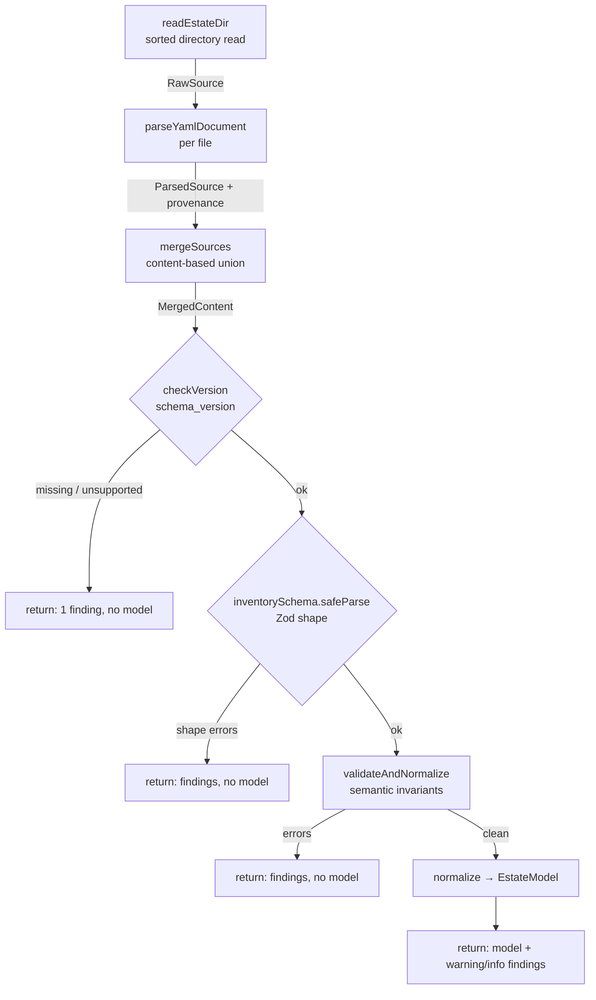

# Architecture

`@pulse/core` is a single-pass pipeline: a directory of estate YAML enters, and a typed
`EstateModel` or an ordered set of `Finding`s leaves. This document explains how the pipeline
is wired, the boundaries it enforces, and why the output is deterministic.

## The pipeline

`loadAndValidate(dir, opts?)` threads **one** `FindingCollector` through a fixed sequence of
phases. Each phase appends findings as it discovers them; the final result is computed from
whether any `error`-severity finding was recorded and whether a model was built.

The phases, in order:

1. **Read** (`readEstateDir`) — Scans `dir` for `*.yaml` / `*.yml` (or reads an explicit
   `opts.files` list), returning `(relative-file, text)` pairs **sorted ascending by file
   name**. This sort is the determinism seam; the merge and every downstream finding order
   derive from it. This phase — and only this phase — may throw a `ConfigIoError`.
2. **Parse** (`parseYamlDocument`) — Parses each file with a location-aware YAML reader,
   building a per-file index from every node's snake_case dotted path to its 1-based
   `{ line, col }`. Malformed YAML becomes a `malformed_yaml` finding and the file contributes
   nothing further; it is never a throw.
3. **Merge** (`mergeSources`) — Unions the parsed files into one raw content object. Any file
   may contribute any top-level section; filenames carry no meaning. Collections are joined
   into insertion-ordered arrays. Duplicate identities and a second `estate` block become
   findings that name **both** locations.
4. **Version short-circuit** (`checkVersion`) — Reads `estate.schema_version` from the *raw*
   merged content, before the body is shape-validated. An absent/non-integer version
   (`missing_version`) or a well-formed integer outside the supported set
   (`unsupported_version`) emits exactly one finding and the pipeline returns immediately.
5. **Shape validation** (`inventorySchema.safeParse`) — A strict Zod schema. Unknown fields,
   missing required fields, wrong types, and invalid enums each map to findings via the
   Zod-issue → `Finding` mapper. `safeParse` never throws.
6. **Semantic invariants + normalization** (`validateAndNormalize`) — Runs five semantic
   detectors that shape alone cannot express, then, only if no `error`-severity finding exists
   anywhere, transforms the validated snake_case tree into the camelCase `EstateModel`.

## The layers

The pipeline is organized into layers with strict responsibilities. Each layer is the *only*
place a given class of problem is decided.

### Shape layer (`schema/`)

A strict Zod schema for a single estate document. Every top-level section is optional (the
merge is content-based, so any one file may omit any section), and the object is `.strict()`
so a typo'd section like `hostz:` is rejected as an unknown field. Hosts are a
`discriminatedUnion` on `collection_class`: each of the five classes validates against exactly
its own fields and rejects the others. The shape layer decides structure and types only —
never cross-element facts.

The five collection classes are fixed for v1:

| Collection class | Required class fields |
|------------------|-----------------------|
| `managed-linux`  | `exporter_ports` |
| `hypervisor-api` | `api_endpoint`, `credential` (secret reference) |
| `nas-api`        | *(none required)* — direct `node_exporter` scrape; `api_endpoint` + `credential` are **optional**, both-or-neither, for the opt-in API-exporter override (issue #4) |
| `probe-only`     | `probe` (kind, target, optional expect) |
| `excluded`       | `suppressed` (class + rationale) |

### Semantic layer (`validate/`)

Six detectors run to completion — none short-circuits, so a single load surfaces *every*
semantic problem at once:

- **Timezone** — `estate.timezone` is required and must be an IANA-parseable zone
  (`missing_timezone` / `invalid_timezone`). It is the source of truth for downstream
  quiet-hours and digest semantics.
- **Suppression rationale** — Every suppression (standalone, and the mark on an `excluded`
  host) carries a non-empty rationale (`missing_rationale`). A silence without a reason is an
  error, not a warning: deliberate silences stay visible and are never confused with forgotten
  gaps.
- **Secret literals** — Channel credentials, `hypervisor-api` host credentials, and a `nas-api`
  host credential *when present* must be references, not literals (`secret_literal`).
- **Collection-class backstop** — Every host declares exactly one valid class (`invalid_enum`).
- **nas-api completeness** — A `nas-api` host's optional `api_endpoint` and `credential` are
  both-or-neither: declaring exactly one is `incomplete_nas_api` (issue #4).
- **Cross-references** — `service.host` resolves against declared hosts (`unresolved_host`);
  each `routing_override` channel resolves against declared channels (`unresolved_channel`).

Only after all five detectors pass does **normalization** run — a total transform of a
known-good tree into the `EstateModel`. Normalization has no config-error path; its internal
`switch` default and credential-parse assertions are unreachable given the gate.

### Version layer (`version/`)

Owns `CURRENT_SCHEMA_MAJOR` (the major this build authors) and `SUPPORTED_SCHEMA_MAJORS` (the
set it accepts — exactly `[1]` in v1). `checkVersion` is pure and total: it never throws, does
no I/O, and returns a discriminated result for any input, because it runs before the body is
shape-validated and so may see any YAML value.

### Findings layer (`findings/`)

The single output vocabulary. A `FindingCollector` accumulates findings across every phase in
insertion order, then `drain()` returns them sorted by a fixed key. The Zod-issue → `Finding`
mapper lives here, as does `formatFindings` for human-readable rendering. `FINDING_CODES`
enumerates every stable code, grouped by producing layer.

### Model layer (`model/`)

Types only — the camelCase `EstateModel` and its members, plus `Provenance`. It is the
downstream vocabulary and deliberately contains no runtime code.

## The findings-vs-exceptions boundary

This boundary is the contract's most important invariant:

- **Config content problems are findings.** Malformed YAML, unknown fields, missing required
  fields, unresolved references, missing rationales, secret literals, unsupported versions —
  all are `Finding`s returned in `LoadResult`. The caller gets a complete, actionable list.
- **Usage failures throw `ConfigIoError`.** The directory doesn't exist (`DIR_NOT_FOUND`), a
  path isn't a directory (`NOT_A_DIRECTORY`), a file can't be read (`UNREADABLE`), or a
  non-string argument was passed (`INVALID_ARG`). `ConfigIoError` is the *only* exception type
  the contract raises; internal errors never leak.

The practical consequence: an agent authoring config wraps `loadAndValidate` in a `try/catch`
for `ConfigIoError` (wrong invocation) and inspects `result.findings` for everything the
config itself got wrong.

## Determinism

The same input directory always yields byte-identical output. This is load-bearing: downstream
tools and tests golden-compare the model and the findings.

- **Sorted read.** Files are read in ascending code-unit order by relative name — not locale
  order, which varies by host. Every subsequent order derives from this.
- **Insertion-ordered collections.** Merged hosts/services/channels are plain arrays in read
  order, never a `Map` or `Set` whose iteration order could vary.
- **Fixed finding sort.** Findings sort by `(file, path, code, severity, message)`, each
  compared by code point, so the result is independent of which phase added them.
- **Relative paths, no ambient state.** `Provenance.file` and `Finding.file` are relative to
  the loaded directory. No output reads the clock, PID, environment, or locale.

## Provenance

Every model element and every finding can name where it came from. During the parse phase, the
YAML reader records each node's 1-based `{ line, col }` keyed by its snake_case dotted path.
The merge folds every file's per-file index into one unified `ProvenanceIndex`, remapping
merged paths back to their origin file and original path. A lookup for a node that was never
captured (for example, a missing field) falls back to the nearest present ancestor's location,
so a `Provenance` always resolves.
