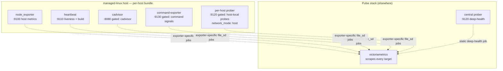
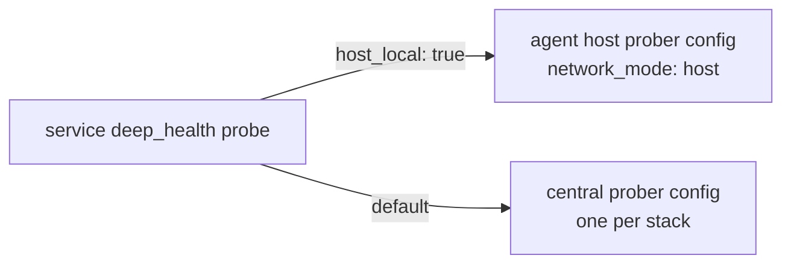

# Architecture

host-agent is not a single program. It is a set of **estate-agnostic component templates** —
per-host exporters plus one central prober — that Pulse installs onto managed-linux hosts to
supply the infrastructure metrics and deep-health signals the engine scrapes. Its "architecture"
is the components, the two delivery forms that install them, the single rendered-config seam they
share, and the boundaries that keep every shipped template free of estate literals. This document
explains each.

## The components

Every managed-linux host runs a **per-host bundle**; the stack runs **one central prober** for
the whole estate. Each component serves a fixed, read-only metrics surface on a pinned port.



| Component | Port | Presence | Serves |
|-----------|------|----------|--------|
| `node_exporter` | `9100` | always | Upstream host CPU/mem/disk/net/load (`node_*`) |
| heartbeat exporter | `9110` | default; scrape+descriptor opt-out via `heartbeat: false` (issue #30) | `pulse_agent_up`, `pulse_agent_build_info` |
| cAdvisor | `8080` | opt-in (`cadvisor: true`) | Upstream per-container metrics (`container_*`) |
| command-exporter | `9130` | gated (host runs ≥1 command signal) | `pulse_backup_freshness_*`, `pulse_command_signal_up`, operator scalar/exposition series |
| per-host prober | `9120` | gated (host owns a host-local probe) | `pulse_deep_health*` for loopback/bridge-local targets |
| central prober | `9120` | one per stack | `pulse_deep_health*` for network-reachable targets |

The two Bun-based exporters (heartbeat, command-exporter) and the prober are built from the
`agent/` tree; `node_exporter` and cAdvisor run their pinned upstream images. Every image tag is a
concrete pinned patch (`agent/contract/constants.ts` `PINNED`), never `latest` — a bring-up is
reproducible.

## The single-config seam: `rendered/agent/<host>.yaml`

Everything host-specific about a bundle — which delivery form to install, whether cAdvisor is
enabled, which scrape ports to expose — lives in **one** rendered file per host,
`rendered/agent/<host>.yaml`, validated by `agent/contract/config.schema.json` (the
`AgentHostConfig` shape). Both delivery forms consume this same file, so `render` describes the
bundle once and `deploy` assembles it identically whichever form a host uses.

```yaml
# rendered/agent/<host>.yaml — AgentHostConfig
host: harbor-web-01
deliveryForm: compose        # "compose" | "systemd"
cadvisor: true               # opt-in (default off); scrapePorts.cadvisor present IFF this is true
heartbeat: true              # opt-in (default on); scrapePorts.heartbeat present IFF this is true
scrapePorts:
  node: 9100                 # always present
  heartbeat: 9110            # present IFF heartbeat: true (schema-enforced; default on)
  cadvisor: 8080             # present IFF cadvisor: true (schema-enforced)
```

A node-exporter-only host (a native `node_exporter` binary with no container runtime — set
`heartbeat: false` in the estate) renders `heartbeat: false` with `scrapePorts: { node: 9100 }`
alone, so the descriptor stays honest about what the host actually runs (issue #30/#33): the
heartbeat container/unit is gated off symmetrically with cAdvisor. `node` (`:9100`) is the one mandatory
port — `HostDown` reads `up{job="managed-linux"}`, which is node-exporter.

This config is authoritative at **assembly time**: `deploy-toolkit` reads
`deliveryForm`/`cadvisor`/`scrapePorts` from it to decide what to install. The bundled processes
do **not** parse it at runtime — the compose fragment even mounts it into the heartbeat container
only for on-host self-description/parity, and the heartbeat serves a fixed exposition regardless.
The schema invariants the file enforces: `scrapePorts.cadvisor` is present **iff** `cadvisor:
true`, and `scrapePorts.node` is always present.

Two *other* rendered configs are parsed by their consumers at runtime, and are distinct from this
one — the command-exporter config (`§ command-exporter`) and the prober config (`§ the two
probers`).

## The two delivery forms

host-agent ships the same bundle in two shapes; `deliveryForm` selects one:

- **Compose** (`agent/compose/agent.fragment.yml`) — a single Compose fragment defining every
  service (`node-exporter`, `cadvisor`, `heartbeat`, `command-exporter`, `prober`). Optional
  services are gated behind Compose profiles (`cadvisor`, `command-exporter`, `deep-health`);
  `PULSE_AGENT_HOST` selects which host's rendered configs mount in.
- **systemd** (`agent/systemd/*.service`) — five Podman-backed units, one per component.
  `deploy-toolkit` installs and `systemctl enable --now`s only the units a host needs:
  node_exporter and heartbeat as bundle core members; cAdvisor only when `cadvisor: true`;
  command-exporter only when the host runs ≥1 command signal; the per-host prober only when the
  host owns a host-local probe. The estate `heartbeat: false` opt-out (issue #30) currently gates
  only the central scrape target and the rendered descriptor port; skipping the heartbeat unit on a
  bundle host that opts out is a tracked deploy-toolkit follow-up. Its intended use is a
  node-exporter-only host that installs no bundle at all.

Both forms run the **same pinned images**, expose the **same ports**, and read the **same
rendered configs** — the delivery form is an installation detail, not a behavioral one.

## Estate-agnosticism and host-identity labelling

No shipped template carries a host, domain, or credential literal (`REQ-BUNDLE-04`). A component
is specialized entirely by its rendered config and by the `host` label applied **at scrape time**:

- **node_exporter, cAdvisor, heartbeat, command-exporter, and the per-host prober** do not
  self-emit host identity. VictoriaMetrics scrapes them through exporter-specific rendered
  `file_sd` groups, each carrying the `host` label and promoting `host` → `instance`. This is why
  the per-host prober **suppresses** its own `host` label
  (`PULSE_PROBER_SUPPRESS_HOST_LABEL=1`) — the scrape-time label owns identity.
- **The central prober** has no per-host `file_sd` relabel (it is one static job serving many
  hosts), so it **self-emits** `host` and `service` on every `pulse_deep_health*` series.

A downstream cross-family join therefore reconciles `host` ⇔ `instance` as a label rename — the
same host string under two keys. The full contract is in
[`agent/contract/metrics-contract.md`](../../../agent/contract/metrics-contract.md).

## The two probers: central by default, per-host for local targets

Deep-health probing GETs a service's JSON health endpoint, maps `responseMapping` JSONPaths to
numeric samples, and emits `pulse_deep_health{host,service,metric}` +
`pulse_deep_health_up{host,service}`. By default this runs on the **central** prober — one
container for the whole stack. But a service can declare `deep_health.host_local: true` (issue #8)
for an endpoint only reachable from the service's **own** host — a `127.0.0.1` or bridge-local
address that, from the central container elsewhere, would resolve to the wrong machine.

The renderer routes such a probe out of the central `prober/config.yaml` into a **per-host** file
at `agent/<host>/prober/config.yaml`, grouped by the service's host
(`packages/renderer/src/render/prober.ts`). `deploy-toolkit` gates the per-host prober unit on the
presence of that file. The per-host prober:

- runs the **same** pinned prober image and config loader as the central one — it reads
  `/rendered/prober/config.yaml`, so binding this host's config there needs no code change;
- runs under `network_mode: host`, so `127.0.0.1`/bridge-local targets resolve on the host (the
  whole point);
- sets `PULSE_PROBER_SUPPRESS_HOST_LABEL=1` so its exposition omits `host` and the scrape-time
  `file_sd` label owns it; it listens on `:9120` on the host and is discovered through that host's
  `managed-linux-prober` scrape group.

A `host_local` probe **requires a managed-linux host** — `@pulse/core`'s
`checkHostLocalProbeHost` invariant raises a `host_local_probe_host` error at validate time if the
service's host is any other collection class, since only a managed-linux host carries the bundle
that runs a per-host prober.



Both probers share the same fail-visibility discipline: a probe failure sets `_up = 0` and leaves
the last-good value and last-scrape timestamp **untouched**, so a downstream sees either a stale
value or `_up == 0`, never a silently-missing failure. `runProbe` is total — one hung or erroring
endpoint can neither crash the prober nor stall its siblings (the cycle fans out under a bounded
worker pool). An absent config is a non-event (healthy idle); a malformed one is fatal at startup
(a failed healthcheck, never a silent stop).

## The command-exporter: a generic command-to-metric bridge

The command-exporter (issue #3) runs a host's estate-declared read-only commands on a cadence and
publishes their output as metrics — the mechanism that finally delivers the long-declared
backup-freshness contract. It parses its own rendered config
(`rendered/command-exporter/<host>.yaml`) at runtime and runs each signal on **its own**
`intervalMs`. A signal has one of two output modes:

- **scalar** — the command prints one number; the exporter emits the signal's declared
  `metric{labels}` (the value) and `upMetric{labels}` (1 = ran, 0 = blind).
- **exposition** — the command prints Prometheus text; the exporter passes it through verbatim and
  adds `pulse_command_signal_up{signal}` liveness.

The headline wiring: a service's `backup_freshness.command` (an argv that prints the newest
backup's age in **seconds**) is compiled by the renderer into a **scalar** command-signal on the
service's host, emitting `pulse_backup_freshness_age_seconds{host,service}` and
`pulse_backup_freshness_up{host,service}` — the series `stack/alerting` selects. `service` is
baked into the signal's labels; `host` is scrape-applied. A host that declares any command signal
runs the exporter on `:9130`, discovered through the dedicated
`managed-linux-command-exporter` file_sd group.

Commands run as **argv, without a shell**, bounded by a timeout (`PULSE_COMMAND_TIMEOUT_MS`,
default 10s); a non-zero exit, a timeout kill, a spawn failure (`ENOENT`), or unparseable scalar
stdout are all **data** — recorded as `_up = 0`, never a thrown error. The last successful value
is retained across a later failure (fail-visible stale value). The image is command-agnostic: the
operator populates `/opt/pulse` with the scripts a host's signals name. Adding the `command`
family bumped the metric contract to version 2 (`CONTRACT_VERSION`).

## Security surface

Every component exposes only read paths — `GET /metrics` (all) and `GET /healthz` (the two
probers, the command-exporter). There is **no write or control route**; a non-`/metrics` path is a
404 and a non-GET on `/metrics` is a 405. The host-introspection mounts (node_exporter's rootfs,
cAdvisor's `/sys`, `/var/lib/docker`) are read-only; cAdvisor is the only privileged service.
Every unit self-restarts (`restart: unless-stopped` / `Restart=on-failure`).

Credentials never appear as literals. A deep-health probe or command signal carries only a
`SecretRef.raw` reference (e.g. `${TOKEN}`); the prober resolves `${ENV}` to a Bearer token from
its own environment at runtime, and the command-exporter injects the reference into the command's
`PULSE_SIGNAL_CREDENTIAL` env var. A resolved value is never logged, never written to a metric,
and never rendered — error messages carry only the env-var name. A declared-but-unresolvable
credential is a fail-visible probe error (the endpoint would 401 anyway).

## How host-agent fits the engine

host-agent settles the `prober` slot stack-core reserved (the `deep-health` profile). The engine
scrapes node-exporter through `scrape/file_sd/managed-linux.json` and each auxiliary bundle
component through its exporter-specific rendered file_sd group; every managed-host job promotes
`host` to `instance`. It scrapes the central prober through a static job; the metric contract
(`agent/contract/metrics.json`) is the versioned surface `alerting` binds rules against and
`dashboards` builds panels against. The renderer emits the per-host `AgentHostConfig`, the
command-exporter and prober configs, and the `file_sd` groups; `deploy-toolkit` assembles the
bundle from host-agent's estate-agnostic templates. render ≠ deploy: host-agent ships the
templates and the contract, and the deploy toolkit places the rendered configs and installs the
components.

## Verification

The delivery structure is checked without starting containers
(`agent/tests/compose.config.test.ts`, the golden agent-config test, the contract test). The
Docker-backed tests (`bringup.smoke.test.ts`, the prober/command-exporter integration tests) build
local images and verify runtime behavior, self-skipping only when no Docker daemon is reachable.
Run the repository gates: `bun run typecheck`, `bun test`, `bun run smoke`.

## Further Reading

- [README](./README.md) — What host-agent is and its rendered-config overview
- [API Reference](./api-reference.md) — Ports, the metric contract, rendered-config input shapes, environment variables, and the importable TypeScript surface
- [Integration Guide](./guides/integration.md) — Installing the bundle, enabling host-local probes and command signals, and building the images
