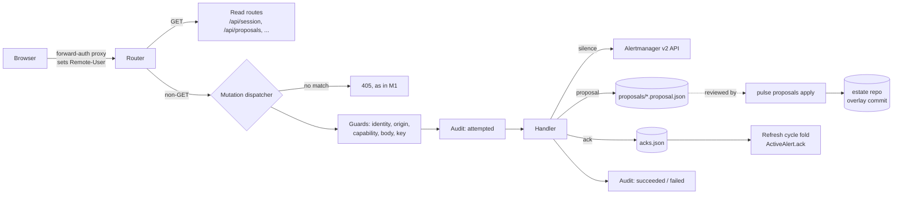
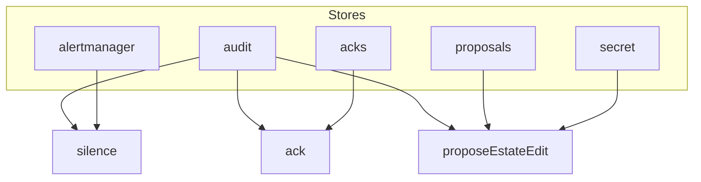
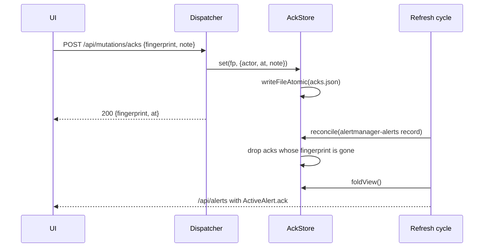

# Architecture

This page explains how the write path is built: what is constructed at startup, how a mutation request moves through the dispatcher, how store health drives capabilities, and how acks and proposals keep their state honest.

## System Overview



The write path is a server-side subsystem with three consumers:
- the alerts view (silence and ack affordances, ack markers);
- the estate entity page (the propose-edit action and the proposal list);
- the overview (ack markers, including the wallboard's aggregate count).

## Startup and Darkness

`main()` in `apps/web/src/server/index.ts` is the only place the write path is built:

```text
config.identity.mode === "proxy-header"
  → buildWriteRuntime(config, { secret: loadProposalSecret(env) })
  → createServerRuntime(config, write.runtimeDeps)   // adds ackStore + onSlowCycle
  → write.attachRuntime(runtime)
  → createFetchHandler(runtime, undefined, write.dispatcher)
```

In `none` mode none of this runs:
- the router keeps its M1 default dispatch hook, which returns `null`, so every non-GET request gets the JSON `405`;
- no providers are installed, so `/api/session` reports every capability as `false` and `/healthz` reports every write-path entry as `auth-mode-none`;
- `createMutationRegistry` itself throws `MutationRegistrationError` (rule `auth-mode`) outside `proxy-header`, so the write path cannot be switched on by accident.

`buildWriteRuntime` builds its parts in a fixed order, and **a store failure never aborts startup**:

1. **Alertmanager write client.** Built from `PULSE_ALERTMANAGER_URL`. If the constructor throws, a disabled client is used and the `alertmanager` store is `not-configured`.
2. **`createWritePath`, then the first `probe()`.** The probe runs `mkdir -p` and access checks for each filesystem store.
3. **Audit writer.** A null path or a constructor throw falls back to an inert writer whose appends always fail. `attempted` then refuses, and the `audit` store reports its reason.
4. **Ack store.** A null path gives a disabled store with reason `not-configured`; a failed load gives a disabled store with reason `unwritable`.
5. **Proposal store.** A null path gives a disabled store that marks `proposals` failed on write.
6. **Second `probe()`.** Picks up the ack store's load status.
7. **Idempotency store, registry, `createMutations`, dispatcher.**
8. **Providers.** Installs the session and health provider (`setWritePathProvider`), the metrics provider (`setWritePathStatusProvider`) and the proposal-list provider (`setProposalStoreProvider`).

`close()` uninstalls every provider and closes the audit writer.

## Request Lifecycle

`createMutationDispatcher` returns the router's `MutationDispatcher`. The pipeline is strictly ordered: each check runs only after the previous one passes, and only step 11 has side effects.

| # | Step | Refusal on failure |
|---|---|---|
| 1 | `registry.match(pathname)`: exact path, and the method must be `POST` | Returns `null`, so the router answers `405` |
| 2 | Mint the request id (UUID v4). Every later response carries `x-request-id` and `cache-control: private, no-store` | None |
| 3 | `resolveIdentity`: trusted peer CIDR plus the identity header | `untrusted-identity` (403) |
| 4 | `checkSameOrigin` | `cross-origin` (403) |
| 5 | `computeCapabilities(identity, mode, writePath.snapshot())` | Store denial: `write-path-degraded` (503). Other denial: `capability-false` (403) |
| 6 | Content type is `application/json` (optionally with `charset=utf-8`); body at most 16 KiB (checked via `Content-Length`, then by counting the stream) | `invalid-body` (400) / `body-too-large` (413) |
| 7 | `Idempotency-Key` matches `^[A-Za-z0-9_-]{8,128}$` | `missing-idempotency-key` (400) |
| 8 | Strict UTF-8 decode, `JSON.parse`, strict zod parse, then `def.validate(body, ctx, now)` | `invalid-body` (400), with `details.fields` |
| 9 | Idempotency lookup by `{subject, action, key}` plus a canonical body hash | Replay, `idempotency-conflict` (409), or wait on the in-flight request |
| 10 | Append the `attempted` audit event | `audit-unavailable` (503). The request is refused and `audit` is marked degraded |
| 11 | `def.handler(body, ctx, identity, {requestId, now})` | The handler's own `failed` outcome |
| 12 | Append the `succeeded` or `failed` audit event (same `requestId`) | Never changes the response |
| 13 | Store the outcome for replay, record metrics and log, respond | None |

Notes on individual steps:

- **Same origin (step 4).** If `Sec-Fetch-Site` is present, it decides alone: only `same-origin` passes. Otherwise `Origin` must be a bare http(s) origin whose host matches `Host` under the same scheme. Modern browsers always send `Sec-Fetch-Site`, so a proxy that rewrites `Host` breaks only clients that omit it. Keep `Host` intact anyway.
- **Key before body (steps 7 and 8).** The idempotency key is checked before the body is parsed. A request with both a missing key and a malformed body reports the key.
- **Field paths (step 8).** `details.fields` carries sanitized dot-paths only, comma-joined and at most 512 bytes. It never includes values.
- **Replay (step 9).** A replay returns the stored response, including its original `requestId`, plus `idempotency-replayed: true`. It writes no audit record and has no effect.
- **Encoding defects (step 10).** An audit-encoding defect is refused as `internal` and does not degrade the write path.

**Refusals** (steps 1–10) are never audited and never cached for idempotency. They are counted in `pulse_web_mutation_refusals_total{action,reason}` and logged as `mutation_refused`. **Failed outcomes** (step 11) are audited, cached and replayed exactly like successes.

The dispatcher never rejects. An uncaught error becomes an `internal` refusal and a `mutation_internal_error` log. A `finally` guard releases the idempotency entry so waiting requests do not hang.

### Outcome normalization

Handlers return `MutationOutcome`. `resolveFailedPolicy` sets the HTTP status and code from the reason; a handler cannot choose its own status:

| Failed reason | Status | Code |
|---|---|---|
| `alert-not-firing`, `silence-gone`, `entity-not-found` | 404 | `TARGET_NOT_FOUND` |
| `stale-proposal` | 409 | `INVALID_REQUEST` |
| `write-failed`, `internal` | 500 | `INTERNAL_ERROR` |
| `upstream-timeout` | 504 | `SOURCE_TIMEOUT` |
| any other `upstream-<kind>` | 502 | `SOURCE_UNAVAILABLE` |

Refusals and failures share one envelope: `{code, message, details: {reason, requestId, fields?}}`. `message` is fixed catalog text. The client ignores it and maps `details.reason` to its own copy.

## Capabilities and Write-Path Health



`computeCapabilities` returns flags and denials. A denial is decided in this order: mode, then identity, then the first failing store in the capability's `CAPABILITY_STORES` list.

The `WritePath` object owns the per-store `StoreStatus {ok, reason}`:

- **`probe()`.** Single-flight, and never rejects. For each filesystem store it runs `mkdir -p` (failure gives `missing`), a `W_OK` access check (failure gives `unwritable`), and for the audit file an open in append mode. The acks store also reports the ack store's sticky load status (`corrupt` or `unwritable`).
- **`markFailed(store, reason)`.** Handlers and the dispatcher call it when a real write fails. It overlays a failure on a store that probed healthy. Only a successful probe that **started after** the mark clears it, which a sequence number enforces. So a recovery can never be based on a probe that ran before the failure.
- **Probe schedule.** Probes run twice at startup, then on every slow cycle, which the refresh loop fires every 60 s. The slow-cycle hook also sweeps expired idempotency entries.
- **Transitions.** Changes are logged as `write_path_degraded {store, reason}` and `write_path_recovered {store}`.
- **Fixed stores.** `secret` is fixed at startup. `alertmanager` is not probed for reachability: Alertmanager being down shows up as `upstream-*` failures, not as a degraded store.

`/healthz` gains `writePath: {silence, ack, proposeEstateEdit}`, one `{ok, reason}` per capability. It never changes the top-level `status`. The metrics endpoint exposes `pulse_web_write_path_status{store,reason}`.

## Audit

The feature reuses the web data tier's append-only JSONL writer, which fsyncs before it resolves. By default the file is `$PULSE_WEB_DATA_DIR/audit/audit.jsonl`. Each event looks like this:

```json
{"at":"2026-09-30T12:00:00.000Z",
 "actor":{"subject":"alice","displayName":"alice","source":"proxy-header"},
 "action":"silence.create","capability":"silence",
 "target":"alert:3f2a…","outcome":"attempted",
 "requestId":"6b1e…","correlationId":null,
 "details":{"endsAt":"…","durationSeconds":7200,"matcherCount":2,
            "matchers.1":"alertname=DiskFull,host=nas01",
            "matchersSha256":"…","rationale.1":"disk cleanup in progress"}}
```

`encodeAuditDetails` keeps every value within the writer's per-value bound:
- **Chunking.** Free text is split into numbered chunks with fixed caps: `rationale` 8 chunks, `note` 5, `matchers` 12, `silenceId` 2. `matchers` also records `matchersSha256` and `matchersTruncated`.
- **Neutralization.** Control characters are neutralized: `\n` becomes `␤`, and other control characters become U+FFFD.
- **Validation.** Any event the writer would reject is caught before the append.

The finalize record merges the attempted details with the outcome's details, such as `silenceId`, `removed` or `reason`. If the merged record is invalid, the dispatcher falls back to the attempted details plus `reason`. Pulse does no rotation; see the operator guide for growth estimates and backups.

## Silences

Silences are the only action that calls an upstream. The handler builds an Alertmanager v2 `CreateSilenceRequest`:
- every matcher is `isRegex:false, isEqual:true`;
- `startsAt` is now;
- `createdBy` is the actor's display name;
- `comment` is `"[pulse] " + rationale`.

It makes exactly one call, with no retry.

The server accepts:
- 1 to 24 matchers, which must be unique and must include `alertname`;
- an `endsAt` strictly after now and no more than 7 days out;
- a rationale of 10 to 500 code points that fits the 512-byte comment together with its prefix.

The client narrows the window further: its 7-day preset is 7 days minus 60 s, to absorb clock skew.

Expiring a silence does **not** check who created it. Any silence Alertmanager lists can be expired, including one created outside Pulse. If Alertmanager returns a 404, the result is `silence-gone`. It is also `silence-gone` if Alertmanager returns another error while the latest current-or-stale cycle no longer lists the id as active or pending; this covers Alertmanager's `500` for a silence that has already expired.

The silence dialog builds matchers only from the labels on the alerts wire, which the Alertmanager source filters down to `alertname`, `severity`, `host`, `service` and `instance`. A UI-created silence can therefore match more broadly than the full Alertmanager label set, and the dialog's live "would silence N alerts" count is computed against the same filtered labels.

## Acks



### Ack store

- **Storage.** A single `acks.json` file (format `pulse-acks/v1`) keyed by alert fingerprint and serialized canonically: keys sorted, 2-space indent.
- **Serialized writes.** Every change goes through one promise chain, so exactly one read-modify-persist runs at a time.
- **Copy-on-write.** Each change builds a new map and replaces the committed copy only after `writeFileAtomic` succeeds. A failed write leaves memory unchanged and calls `markFailed("acks", "write-failed")`.
- **Setting.** `set` is last-writer-wins. Setting an ack requires the fingerprint to be in the current cycle's alert list, in any state (firing, silenced or inhibited). Otherwise the result is `alert-not-firing`.
- **Removing.** `remove` is idempotent and anyone with the capability may remove anyone's ack. `removed` reports whether an ack existed.

### Load failures are sticky

If `acks.json` is corrupt or unreadable at startup, the store disables writes for the life of the process and the `acks` store reports `corrupt` or `unwritable`. A corrupt file is logged (`ack_store_corrupt`) and left in place for the operator to inspect. Restoring or removing it requires a restart.

### Auto-clear

Every refresh cycle calls `reconcile` with the Alertmanager alerts record **before** the fold:
- it clears acks only when that record holds a fresh, successful fetch from this cycle;
- any ack whose fingerprint is absent from the fetch is dropped, all in one commit;
- a stale or unavailable source clears nothing, so an outage cannot wipe acks;
- silenced and inhibited alerts are still listed, so their acks survive.

On success the store logs `ack_auto_cleared` and increments `pulse_web_ack_auto_clears_total`. A failed commit is retried on the next cycle, and `reconcile` can never stall a cycle.

### The alerts wire

The fold projects the store (dropping `subject`) onto `ActiveAlert.ack?: {by, at, note}`. The field is present only when the alert is acknowledged, never `null`. The overview summary carries `acked?: true`.

## Proposals

A proposal passes through two processes that never share memory: the web app writes proposals and the CLI decides them. They share only the directory and the HMAC secret.

```mermaid
sequenceDiagram
  participant UI as Estate entity page
  participant W as Web handler
  participant Dir as proposals/
  participant CLI as pulse proposals apply
  participant Git as Estate repo
  UI->>W: {target, changes[{field, seen, proposed}], rationale}
  W->>W: resolve entity; seen == current? applicable?
  W->>Dir: <id>.proposal.json (signed, exclusive create)
  CLI->>Dir: read + verifyProposal
  CLI->>Git: clean tree? load + validate estate
  CLI->>CLI: seen == current? (stale check)
  CLI->>Git: edit one overlay, re-validate, render, commit
  CLI->>Dir: <id>.result.json {applied, commit}
```

### Format and signing

A proposal file (`pulse-proposal/v1`) has two parts:
- a **payload**: `id`, `createdAt`, `requestId`, `proposer {subject, displayName}`, `target {kind, id, name}`, 1 to 5 `changes {field, seen, proposed}` and a `rationale`;
- a **signature**: `{alg: "HMAC-SHA256", value}`, computed over the canonical JSON of `{format, payload}`, so the format tag is covered too.

Canonical JSON sorts keys by UTF-16 code unit, emits no whitespace, normalizes `-0`, and refuses any value that is not JSON. Verification never throws. It reports `unparseable`, `schema`, `alg` or `signature`, and compares MACs with `timingSafeEqual`.

Ids look like `p-YYYYMMDDTHHMMSSZ-<8 hex>`. The file-name builders refuse anything that does not match that shape, which rules out path traversal.

### Proposable fields

| Field | YAML key | Applies to | Value |
|---|---|---|---|
| `expectedChurn` | `expected_churn` | hosts | boolean |
| `scrapeIntervalClass` | `scrape_interval_class` | hosts (nullable) | string |
| `cadvisor` | `cadvisor` | managed-linux hosts | boolean |
| `heartbeat` | `heartbeat` | managed-linux hosts | boolean |
| `suppressed` | `suppressed` | `excluded` hosts; services (nullable) | suppression mark `{class, rationale}` |

A service's `suppressed` field does not apply when a standalone suppression already covers the service. Core decides this with `readCoreValue`, working on the estate model. The web app decides it with `readProposableValue`, working on the rendered model. A parity test holds the two implementations to the same answers.

### Freshness is checked twice

Every change carries `seen`, the value the operator saw. The web handler refuses a change whose `seen` no longer matches the current rendered value (`stale-proposal`, 409; the audit record names it as `staleField`) or a field that does not apply to the entity. `apply` repeats both checks against the estate as it stands when the proposal is applied. A proposal can go stale while it is pending; it is then refused with `PROPOSAL_STALE` and never merged over.

### Decisions

A proposal's state is derived from its sidecar file `<id>.result.json`:
- no sidecar: `pending`;
- `{state:"applied", commit}` or `{state:"rejected", reason}`: decided;
- a sidecar that is unreadable, malformed, a symlink, or names another id: the decision is unknown, so the proposal counts as invalid. The web app leaves it out of the list and counts it in `invalidCount`. The CLI lists it under `invalid` with reason `result-invalid` and refuses to `apply` or `reject` it until the sidecar is fixed or removed.

The CLI writes each sidecar once. The web app never writes sidecars and never modifies proposal files. Sidecars are **unsigned**, because the directory itself is the trust boundary.

### Apply

`apply` is the only code path that turns a proposal into estate changes. It runs these steps in order:

1. **Checks.** Git repo check. Already-decided check. Crash recovery: a commit carrying a matching `Proposal-Id:` trailer and a valid signature completes the missing sidecar.
2. **Clean tree.** Refuses with `PROPOSAL_DIRTY_TREE` if anything is staged, or if tracked files under the estate or output directories are dirty.
3. **Signature.**
4. **Estate validation and staleness.** The target is resolved by `target.name`. That is safe because host and service names are each unique across the estate: a repeated name is a `DUPLICATE_IDENTITY` error, and an invalid estate is refused here with `PROPOSAL_INVALID_ESTATE`. The host part of a `svc:<host>/<name>` id is never consulted.
5. **Choose the overlay.**
   - The entity's owning overlay file, if it lives in one.
   - Otherwise the file named by `--overlay`.
   - Otherwise the only overlay file.
   - Otherwise it refuses with `PROPOSAL_OVERLAY_AMBIGUOUS`.

   The chosen overlay must be tracked by git.
6. **Edit.** The overlay is edited through the YAML document API, which keeps comments and key order. Clearing a key that the base layer declares is refused (`PROPOSAL_CANNOT_CLEAR_BASE`).
7. **Write, validate and render.** An atomic write, then re-validation, then a check that every change took effect, then a render and materialize. Any failure from here on **rolls back**: it unstages, restores the overlay bytes, restores the rendered output and deletes new untracked outputs.
8. **Commit.** `git add` the overlay and the changed rendered paths, then `git commit`. The commit message carries `Proposal-Id`, `Proposed-By` and `Changes` trailers. It **never pushes**.
9. **Sidecar.** Writes the `applied` sidecar with the commit SHA. If this write fails, the commit is kept and a re-run completes the sidecar through crash recovery.

`reject` needs no git. It verifies the signature and writes a `rejected` sidecar with the operator's reason. When the estate is in a git repo and a commit already carries the proposal's `Proposal-Id` trailer (an `apply` that crashed before writing its sidecar), `reject` records the `applied` result instead and reports the proposal as already decided.

## Client Architecture

- **Session and gating.** `ensureSession` fetches `/api/session` once per store and memoizes it; an ill-shaped response leaves the session null, which denies everything. `canAct(store, cap)` returns false in the wallboard density, under `?kiosk=1`, or when the capability is not `true`. A gated-off affordance renders **nothing**, not a disabled control.
- **Refusal handling.** After a refusal caused by `capability-false`, `untrusted-identity` or `write-path-degraded`, the dialog calls `refreshSession`. The affordance then disappears if the capability is really gone.
- **Lazy dialogs.** Each dialog is its own chunk, loaded by `useLazyDialog` when its trigger is clicked. While the chunk loads, the trigger stays focusable and shows `aria-busy`.
- **Request shape.** `postMutation` sends same-origin credentials, `no-store`, and an `Idempotency-Key`. A dialog keeps one key per logical action and reuses it after network errors, so a retry cannot double-apply. It mints a new key after a stored failure.
- **Pending tracker.** After a success, the dialog registers an expectation predicate. For example, `ackSet(fp, at)` is satisfied when the alert's `ack.at` equals `at`, or when the alert is gone. An effect on `store.alerts` clears entries as live data satisfies them. After `PENDING_STALE_MS` (30 s) an unsatisfied entry shows as "not yet reflected" until the operator dismisses it. The tracker never edits `store.alerts` itself.
- **Read-only markers.** `AckInfo`, the Acked badge and chip, and the overview's acknowledged markers show in every density, the wallboard included. Only actions are gated.

The client build names chunks `chunk-[name]-[hash]`. Dialogs are built on the `@/ui` `Dialog`/`AlertDialog` (through `mutations/dialog-frame.tsx`) and styled with Tailwind token classes, which compile into the one global sheet, so the dialog chunks carry no stylesheet of their own.

## Performance Characteristics

- **Latency.** A mutation adds two fsync'd audit appends and, for acks or proposals, one atomic file write (temp file, fsync, rename, directory fsync). There is no request-path I/O beyond that plus the upstream call for silences.
- **Idempotency cache.** An in-process `Map` capped at 10,000 entries. Eviction removes expired entries first, then the oldest completed ones.
- **Ack reconciliation.** One pass over the Alertmanager alert list per cycle. It writes the file only when something is actually cleared.
- **Proposal listing.** `GET /api/proposals` reads the directory on every request, verifies each candidate, and returns at most 50 entries for the requested entity, newest first.
- **Client bundle.** Dialogs are lazy, and the client imports `@pulse/core/proposals` as types only. No zod or core code reaches the client bundle.

## Security Boundaries

- **Identity.** It comes from a header, and the header is trusted only when it comes from a peer in `PULSE_WEB_TRUSTED_PROXIES`. Everything rests on forward-auth being the only route to the app.
- **Cross-site requests.** Same-origin enforcement (`Sec-Fetch-Site`, or `Origin` against `Host`) plus a strict JSON content type block cross-site form posts. The client sends no CSRF token.
- **Request bounds.** Strict schemas refuse unknown keys everywhere. Bodies are capped at 16 KiB. Error responses carry field paths, never values.
- **What the client sees.** It receives only the identity's display name. The subject is never served, including in proposal listings.
- **Proposals.** The HMAC stops forged or tampered proposal files. Sidecars are unsigned, so write access to the proposals directory is equivalent to deciding proposals. The CLI strips `PULSE_PROPOSAL_SECRET` from git's child environment.
- **No per-user authorization.** Every authenticated identity has the same capabilities.

## Design Rationale

- **A separate registry instead of widening GET routes.** The read-only guarantee stays structural: the read route type cannot express a write, and the mutation registry cannot exist without `proxy-header`.
- **Audit before effect, fail closed.** An action that cannot be recorded does not happen. A finalize failure cannot undo an effect that already happened, so it is logged and counted instead of turned into an error the operator would retry.
- **Capabilities follow store health, not only identity.** A broken volume or missing secret removes the affected actions from the UI instead of offering buttons that are bound to fail. Monitoring itself is unaffected.
- **Failed outcomes are replayable.** A retried request with the same key gets the same answer, even for upstream failures, so a flaky network cannot turn one intent into two effects. A new attempt needs a new key, which the client mints after a stored failure.
- **Acks are app-local and self-clearing.** An ack means "someone is on this firing instance". Tying its lifetime to Alertmanager's listing means a later re-fire is noticed as new, and the fresh-fetch requirement means a source outage cannot erase ownership.
- **Proposals go through git, not the web app.** The estate declaration remains a reviewed repository. The web app is neither trusted with write access to it nor able to bypass validation and rendering. Every applied change is one ordinary, reviewable commit that you push yourself.
- **`seen` values instead of locks.** Staleness is detected when the proposal is created and again when it is applied, with no coordination between the web app and the repository.
