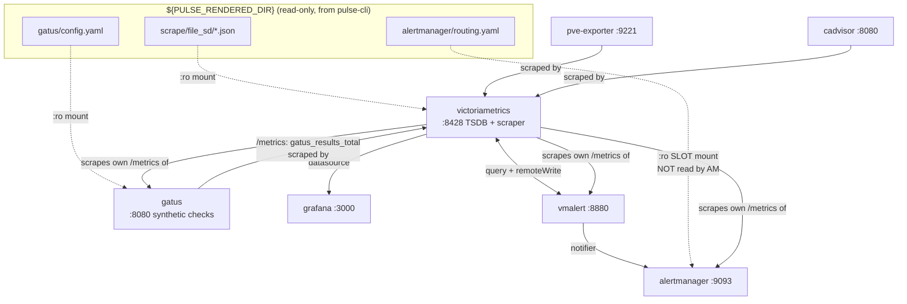

# Architecture

stack-core is a Docker Compose composition, not a program. Its "architecture" is the set of
services it runs, the wiring between them, the two seams through which estate-specific data
enters, and the boundaries that keep the committed tree estate-agnostic. This document explains
each.

## The composition

Ten services attach to one user-defined bridge network (`pulse`) under a fixed project name
(`pulse`). Seven are always-on; three are gated behind Compose profiles.



The seven always-on services are the `DEFAULT_PROFILE_SERVICES` and constitute the green bar: a
plain `docker compose up` must bring all of them to **healthy**.

| Service | Role | Image family (pinned) |
|---------|------|-----------------------|
| `victoriametrics` | Metrics TSDB, query API, built-in scraper | `victoriametrics/victoria-metrics` |
| `vmalert` | Rule evaluator; writes ALERTS/recording series back to VM | `victoriametrics/vmalert` |
| `alertmanager` | Routing / silence / deadman brain | `prom/alertmanager` |
| `gatus` | Synthetic-check engine | `twinproduction/gatus` |
| `grafana` | Dashboards UI | `grafana/grafana` |
| `cadvisor` | Per-container CPU/mem/restarts of the stack's own containers | `gcr.io/cadvisor/cadvisor` |
| `pve-exporter` | Agentless Proxmox API exporter | `prompve/prometheus-pve-exporter` |

The two profile-gated slots — `web` (`web` profile) and `prober` (`deep-health`) — are inert
under the default profile. Their compose bodies are wired now; the image, command, and
healthcheck land when the owning feature settles them. (There is no nas-exporter slot: a
`nas-api` host is a direct `node_exporter` scrape — issue #4.) Every always-on image is pinned
to a **concrete patch tag** — never `:latest`, never digest-only — so a bring-up is reproducible.

## The two input seams

Everything estate-specific enters through exactly two mechanisms, and nothing else:

1. **The rendered tree** — `${PULSE_RENDERED_DIR}`, mounted read-only. `pulse-cli` renders an
   estate description into a directory of files; stack-core mounts the subtrees each service
   needs. The engine never writes to this tree.
2. **`${VAR}` secret references** — resolved from a git-ignored `.env` at deploy time. The
   compose file carries the reference tokens; the values never touch git.

This is the whole reason the same committed tree boots green from a fictional fixture and runs a
real estate unchanged.

### The rendered-mount map

Each rendered subtree binds into exactly one consumer, always `:ro`:

| Rendered source | Container path | Consumer | Notes |
|-----------------|----------------|----------|-------|
| `scrape/file_sd` | `/rendered/scrape/file_sd` | `victoriametrics` | Prometheus `file_sd` target lists |
| `gatus/config.yaml` | `/config/10-endpoints.yaml` | `gatus` | Merged with stack-core's own Gatus config |
| `alertmanager/routing.yaml` | `/rendered/alertmanager/routing.yaml` | `alertmanager` | **Slot only** — AM does not read it (see below) |
| `prober/config.yaml` | `/rendered/prober/config.yaml` | `prober` | Slot only; the prober slot is deferred |

VictoriaMetrics is told to re-read its scrape config every 30s
(`-promscrape.configCheckInterval=30s`), so a re-rendered `file_sd` is picked up without a
restart.

## The abstract-vs-native Alertmanager distinction

This is the single most error-prone point in the composition, and the reason two Alertmanager
files exist.

Alertmanager boots off **stack-core's native bootstrap**
(`config/alertmanager/alertmanager.bootstrap.yml`), mounted at `/etc/alertmanager/alertmanager.yml`
and named by `--config.file`. That file is a valid native AM config: a root route to a `null`
receiver (so a fixture bring-up is green and silent) plus a `DeadMansSwitch` child route to a
`deadmansswitch` receiver as a wiring slot.

The **rendered** `alertmanager/routing.yaml` is a different shape entirely — an abstract
`{name, config}` receiver form that `pulse-cli` emits. Native Alertmanager strict-unmarshals its
config and **rejects** the `config:` wrapper, so pointing `--config.file` at the rendered file
would make AM refuse to start. The rendered file is therefore mounted only at a **slot path**
(`/rendered/alertmanager/routing.yaml`); AM never reads it in v1. The future `alerting` feature
transforms that abstract routing into a native config that supersedes the bootstrap.

The practical rule: **AM boots off the native bootstrap; the rendered routing is mounted for a
downstream transform, not consumed.**

## The relabel-through exporter pattern

The `hypervisor-api` class is scraped through a relabel-through, not directly. The rendered
target is the estate's *API* endpoint (a Proxmox host), which VictoriaMetrics must **not**
connect to directly. Instead the API job rewrites the scrape so VM connects to `pve-exporter`
and passes the real endpoint as a `?target=` query parameter:

(The `nas-api` class does **not** use this pattern: a NAS runs `node_exporter` directly, so
`nas-api` is a direct node scrape like `managed-linux` — issue #4. The operator "NAS collector"
guide covers the opt-in TrueNAS-API-exporter override.)

```yaml
# hypervisor-api job, relabel_configs (paraphrased):
- source_labels: [__address__]        # (1) rendered PVE endpoint → ?target=
  target_label: __param_target
- source_labels: [__param_target]     # (2) keep a readable instance = the real host
  target_label: instance
- target_label: __address__           # (3) VM actually scrapes the exporter
  replacement: pve-exporter:9221
```

The exporter holds the read-only credential via its own environment (`${PVE_TOKEN}`); the token
never appears in the scrape config. Credential meta-labels (`__pulse_credential__`) are
`__`-prefixed and dropped by VictoriaMetrics post-relabel.

VictoriaMetrics also scrapes each engine component's own `/metrics` (self-observability, static
targets) and cAdvisor for per-container resource metrics — so the stack monitors itself, not
just the estate.

## Health, profiles, and the green bar

Every default-profile service carries a uniform healthcheck budget — `interval: 10s`,
`timeout: 5s`, `retries: 6`, `start_period: 30s` — probing a fixed HTTP path (e.g.
`GET /health` on VictoriaMetrics, `GET /-/healthy` on Alertmanager). The probe command uses the
`wget` present in each pinned image; the path and port are fixed, only the command form is
adjusted per image.

**Gatus is the one deliberate exception.** Its pinned image ships only the `/gatus` binary — no
shell, `wget`, or `curl` — so no in-container command can probe it. Gatus readiness is asserted
out-of-band by the smoke tier's in-stack HTTP probe instead, and Gatus is exempt from the
healthcheck-presence rule.

`depends_on` uses `condition: service_healthy` to order startup: `vmalert` waits on
VictoriaMetrics and Alertmanager; `grafana` waits on VictoriaMetrics; `gatus` has no
dependency (it posts nothing to Alertmanager); the `web` slot waits on all three of
VictoriaMetrics, Alertmanager, and Gatus.

## Ownership boundaries: owned config vs reserved slots

stack-core owns the **engine** and the base config that boots it green. It deliberately does not
own estate *content*. The boundaries:

- **stack-core owns:** the compose tree, the VictoriaMetrics scrape config, the native
  Alertmanager bootstrap, the Grafana VictoriaMetrics datasource, and the static Gatus config
  (`metrics: true`).
- **`dashboards` owns** the Grafana folder taxonomy and dashboard JSON, dropped into the same
  `/etc/grafana/provisioning` tree stack-core mounts (`stack/grafana/` — reserved).
- **`alerting` owns** the vmalert rule library, the severity framework, the DeadMansSwitch
  expression, and the real routing that supersedes the bootstrap (`stack/alerting/` — reserved).
- **`pulse-cli` owns** everything under `${PULSE_RENDERED_DIR}`: scrape targets, Gatus endpoints,
  and the abstract routing.
- **`web-app`** fills the `web` build slot; **host-agent** settles the deferred `prober` slot.

The reserved directories (`stack/alerting/`, `stack/grafana/`) exist as `.gitkeep`-only mount
points today. Downstream features add content without editing the compose file.

### Gatus paging: bind a synthetic check with a service `alerts:` binding

Gatus checks page through **vmalert**, not a Gatus alerting provider. A service declares an
`alerts:` binding in the estate, and the alerting transform (`stack/alerting`) renders one
`GatusCheckFailed` rule for its ingress check into `rendered/vmalert/rules/synthetic.yml`:

```yaml
# estate service — make its synthetic ingress check PAGE.
services:
  - name: portal-web
    host: harbor-web-01
    kind: http
    managed: true
    ingress_url: https://portal.aurora.example
    alerts:
      - type: custom                 # retained for compatibility; selects nothing
        failure_threshold: 3         # failed checks before firing (default 3, max 60)
        success_threshold: 2         # passing checks before resolving (default 2, max 60)
```

The rule reads Gatus's own `gatus_results_total` counter (exposed by the `metrics: true` toggle in
`stack/gatus/alerting-provider.yaml` and scraped by the `gatus` job). With F = `failure_threshold`
and S = `success_threshold`, it **fires** when, within one window, there were at least F failed
checks and no passing check — over F minutes + 30s (about the F-th consecutive failure at Gatus's
nominal 60s cadence) or over 4·F minutes (Gatus runs checks one at a time, so a broad outage
stretches the real cadence; slow checks fire later instead of flapping). Once firing it **holds**
— reading its own state back from the `ALERTS` series vmalert remote-writes, accepting a sample up
to 330s old — until, within ceil(1.5·S) + 1 minutes, at least S passing checks and no failed check
occur. With no fresh results (Gatus down) nothing clears it, so it never false-resolves. vmalert
runs with `-remoteRead.url`, which restores `for:` rules across restarts; this rule has no `for:`
and relies on its own read-back instead. The rule carries the labels the
old provider posted (`severity: critical`, `source: gatus`, `endpoint: <host>/<service>`,
`group: <host>`), plus `name` from the expression and vmalert's `alertgroup` and `estate`. The
renderer emits no `endpoints[].alerts` into `gatus/config.yaml`.

The Gatus→Alertmanager push provider this replaces was retired in issue #1. It never set
`endsAt`, so a resolve re-fired the alert until Alertmanager's `resolve_timeout`, and Gatus sends a
trigger only once, so any outage longer than `resolve_timeout` auto-resolved with a false
"resolved". vmalert re-sends a firing alert every evaluation and sends a real resolve.

A binding only takes effect on a service that renders a Gatus endpoint (has `ingress_url`, not
suppressed); on any other service it is inert and raises an `inert_alert_binding` warning.
Endpoints without a binding stay non-paging by design.

## Verification: a two-tier harness

stack-core is verified by two test suites under `stack/tests/`, sharing one support module
(`harness.ts`) that realizes the constants and types both tiers assert against.

**Tier 1 — hermetic (`config.test.ts`).** Runs under plain `bun test` with **no Docker daemon**.
It parses the compose tree once via `docker compose config --format json` (a static parse +
schema validation + `${VAR}` interpolation that never contacts the daemon) and runs static text
scans over the shipped tree. It asserts: the project name is `pulse` and every default-profile
service is defined; every rendered-mount container path is a `:ro` bind on its consumer; every
`engine-apis` address is wired; **Guard A** — every image carries an explicit tag, never
`:latest` or a digest; **Guard B** — no enumerated credential literal appears in the shipped
tree and `PVE_TOKEN` is only `${VAR}`-referenced; every default-profile service
(except Gatus) declares a healthcheck; the default profile equals `DEFAULT_PROFILE_SERVICES`;
and the fixture's `formatVersion` matches. Both guards use **enumerated protection sets with
explicit non-goals**, never an open-ended "no secrets" objective. This tier requires the Docker
*CLI* but deliberately does **not** self-skip when it is absent — a CLI-less environment must
surface as a legible red failure, never a false green.

**Tier 2 — smoke (`bringup.smoke.test.ts`).** The Docker tier. It **self-skips** the entire
suite (`describe.skip`) when no Docker daemon is reachable, so plain `bun test` stays green in a
daemon-less environment. When Docker is present it: preflights the fixture `formatVersion` before
starting anything; creates a unique `pulse-test-…` Compose project and runs `docker compose -p
<project> up --wait --wait-timeout 180` on the default profile; guarantees a checked `down -v
--remove-orphans` teardown scoped to that project even on failure; asserts every default-profile
service is healthy; and runs four functional probes via a pinned one-shot curl container on the
project-derived `<project>_pulse` network — `vm-self-scrape`, `grafana-datasource`,
`gatus-config-loaded`, `alertmanager-booted`. A fail-loud negative case uses a second isolated
project, points `PULSE_RENDERED_DIR` at a deliberately
malformed subtree and asserts the affected service stays unhealthy (never silent-green).

The seeded fixture (`stack/tests/fixtures/rendered/`) is a byte-for-byte copy of the renderer's
golden tree — fictional estate data that stands in for a real rendered directory so the smoke
tier has something to mount. It is test-only and exempt from the shipped-tree estate-agnostic
guards.
