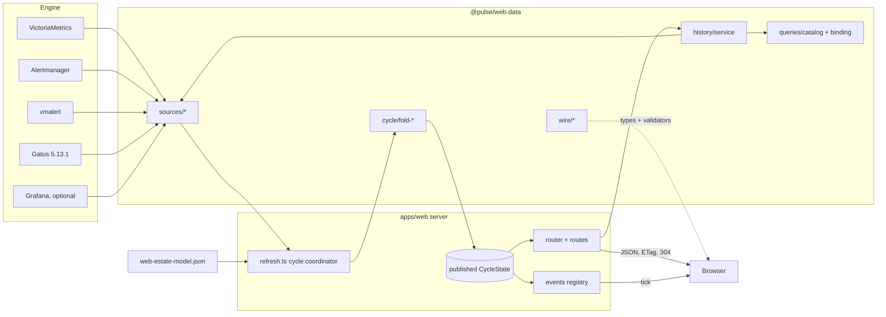
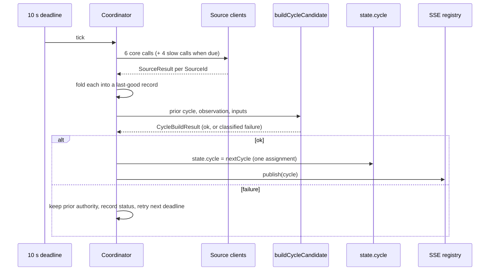
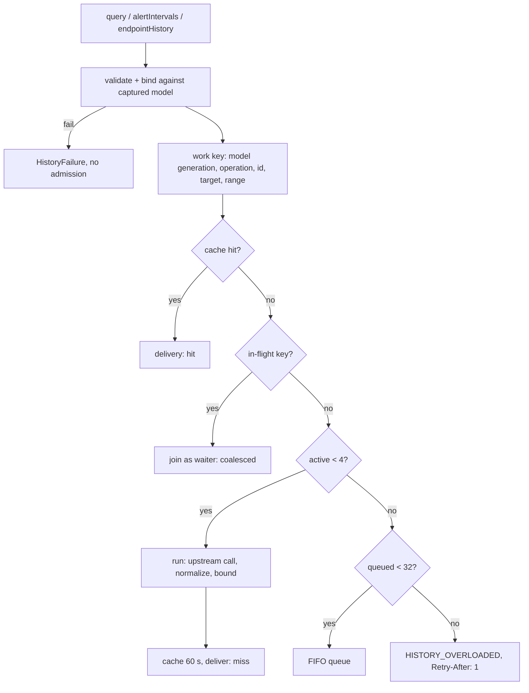

# Architecture

The web data tier sits between the monitoring engine and the browser. A runtime-neutral package (`@pulse/web-data`) holds every contract and every pure or bounded algorithm. The web server (`apps/web/src/server/`) holds everything stateful: the cycle scheduler, the published cycle, the route table, the SSE registry, and metrics.

## System Overview



The browser never contacts an engine component. It reads current views and history only through same-origin `GET /api/*` routes, and it imports only `@pulse/web-data/wire`.

## Package Layout

| Area | Location | Responsibility |
|---|---|---|
| Wire | `packages/web-data/src/wire/` | Browser-safe payload types, fixed limits, error catalogs, runtime validators. No runtime imports. |
| Sources | `src/sources/` | One typed client per engine component, built on a private bounded `fetch` primitive. Every method resolves a `SourceResult` and never throws. |
| Cycle | `src/cycle/` | Fold input records, the five pure view folds, materialization and identity, cycle composition |
| Canonical | `src/canonical.ts` | Deterministic canonical JSON, `sha256:` identities, deterministic gzip |
| Queries | `src/queries/` | The 14-entry curated catalog, range and step planning, the safe PromQL binder |
| History | `src/history/` | The bounded history service: cache, admission, points and interval normalization |
| Identity | `src/identity/` | Deny-by-default trusted-proxy identity configuration and resolution |
| Audit | `src/audit/` | Append-only, fsync'd JSONL audit writer (dark in M1) |

| Area | Location | Responsibility |
|---|---|---|
| Runtime and scheduler | `apps/web/src/server/refresh.ts` | Source bundle, cycle coordinator, history service wiring, publication |
| Router | `apps/web/src/server/router.ts`, `routes/compile.ts` | Compiled GET-only dispatch, parameter decoding and guards, query validation |
| Routes | `apps/web/src/server/routes/` | Registry of 13 routes: current views, session, events, history, health, metrics |
| Representations | `apps/web/src/shared/api/json.ts` | `cycleJsonResponse`: retained bytes, gzip negotiation, strong ETags, 304 |
| Events | `apps/web/src/server/events/` | SSE framing and the process-lifetime stream registry |
| Seams | `apps/web/src/shared/registry.ts` | `RouteDefinition` (including `slashParams`) and `ServerContext` |

The package's `/wire` graph is guarded by a test that fails if a Node or Bun API, a runtime renderer value, or a source or audit module becomes reachable from it.

## Cycle Data Flow



- **Core cadence (10 s):** `victoriametrics-signals`, `victoriametrics-targets`, `alertmanager-alerts`, `alertmanager-silences`, `vmalert-rules`, `gatus-statuses`.
- **Slow cadence (60 s):** `victoriametrics-buildinfo`, `alertmanager-status`, `alertmanager-receivers`, `grafana-health`. A cycle that is not due for slow sources reuses the last published slow records exactly. The slow deadline advances in 60-second steps and never catches up in bursts.
- **Records:** each `SourceId` maps to a record that follows one truth table. A current success is `current`. A failure with a last-good value keeps it as `stale`. A failure with no last-good value is `unavailable`. An unconfigured Grafana is `null` (not-configured) and makes no calls.
- **Gatus completeness:** the statuses call always asks for one page of 512 (`page=1&pageSize=512`). A saturated page, more than 511 expected endpoints, a missing expected endpoint, or a duplicate name or key fails the whole acquisition as `overflow`. A subset is never published.

### Folds

`foldCurrentViews` runs five pure folds over the same captured inputs:

| Fold | Payload | Notes |
|---|---|---|
| `foldOverview` | `OverviewSnapshotV2` | Host grid, service indicators, alerts, checks, Grafana links, and coverage. A Grafana link's `url` is `""` when no Grafana origin is configured. |
| `foldAlerts` | `AlertsPayload` | Alertmanager alerts (firing, silenced, inhibited), every vmalert rule, and silences, each with independent availability |
| `foldEstate` | `EstatePayload` | The rendered model passed through verbatim, joined with liveness and alert evidence; coverage and findings; declared-versus-scraped |
| `foldEngine` | `EnginePayload` | Six fixed components, scrape jobs, rule groups, notification and capacity projections, cycle health, deadman |
| `foldTimeline` | `TimelinePayload` | The history index (see below). It makes no source call. |

A fold reads only its inputs and never makes a source or history call. A thrown fold error is caught at `buildCycleCandidate` and classified as `kind: "fold"`, so the server keeps serving the previous cycle.

### Identity and representations

`materializeCycle` canonicalizes each view to deterministic JSON and hashes it into a semantic identity. Before hashing, it nulls observation-only fields (`generatedAt` and every success timestamp). A cycle that changes only timestamps therefore reuses the prior payload object, its bytes, its gzip bytes, its identity, and both ETags. A change in degraded state is still material, because only the timestamps are stripped.

`cycleJsonResponse` serves a view from one captured cycle reference. It negotiates gzip, returns the retained bytes with a strong ETag (distinct for plain and gzip), and answers a matching `If-None-Match` with a bodyless 304. `x-pulse-observation` (base64url `CycleObservation`) and `x-pulse-payload-id` ride alongside, outside the ETag. Before the first successful cycle, current routes return 503 `NOT_READY`. When the estate bundle is in error mode, the router short-circuits current routes so no stale cycle is served.

## Timeline Index

`foldTimeline` builds an index, not history bodies:

- **Targets.** Every host, service, and endpoint target with at least one applicable curated query. Applicability is decided by running `bindCuratedQuery` against the captured model, so there is no second hand-kept list. Targets are sorted host < service < endpoint, then by id.
- **Parent links.** A host's `parent` is `null`. A service's parent is the host whose `name` equals `service.host`, or `null` if no such host is declared (the service is still listed). An endpoint's parent is its single declaring service.
- **Endpoint targets.** Only Gatus endpoint names declared by exactly one service. A name declared by several services is ambiguous and left out.
- **Domains.** `domains[]` has one `{ domain, endpoint: "dns:<domain>" }` per `model.estate.domains` entry, in model order, deduplicated with the first occurrence winning. A `dns:<domain>` name that some service also declares is left out, because check history resolves it by the service rule. Domain endpoints are not endpoint targets, so they never get a latency chart.
- **Check history.** `checkHistory.endpoints` is the union of resolvable service endpoint names and domain endpoint names, sorted ascending. A client should request check history only for names in this list.

## HTTP Routing

Routes are declared as `RouteDefinition`s whose `method` is the literal `"GET"`, so a mutating route cannot be registered. `assertRegistry` compiles every pattern at load. It rejects malformed patterns, ambiguous same-shape pairs, and any `slashParams` entry that is not a `:param` of that route. A bad registry fails startup before the port is bound.

`matchRoutes` splits the request path on literal `/` **before** decoding, so `%2F` stays inside one segment. Each parameter is decoded exactly once and must be control-free and at most 512 UTF-8 bytes. A decoded `/` is rejected unless the route lists that parameter in `slashParams`. An opted-in value also passes structural checks: it must not start or end with `/`, contain `//`, contain a `.` or `..` piece, or contain `\`. Any failure is a 400 `INVALID_REQUEST`, and the metric label is the route template, never the raw path.

Only two parameters opt in:

| Route | `slashParams` | Example |
|---|---|---|
| `/api/history/target/:drilldownId/:queryId` | `drilldownId` | `/api/history/target/svc%3Aweb%2Fapp/service.deep-health` |
| `/api/history/checks/:endpoint` | `endpoint` | `/api/history/checks/web%2Fapp` |

Accepting `/` here opens no traversal: the value is only ever an exact lookup key into the captured model. It is never a filesystem path or an upstream URL segment, because Gatus receives the derived composite key.

Query strings are capped at 2 KiB and reject repeated keys. History routes accept only `range`.

## History Service



- **Validate and bind first.** The service checks ids, range, and target against the captured model before allocating anything. It resolves an unknown query or target, an inapplicable query, or an over-long range immediately.
- **Deadline and cancellation.** Every operation has a 5-second queue-plus-execution deadline. A caller's `AbortSignal` cancels only that waiter. The upstream call is aborted when its last waiter leaves.
- **Model changes.** `invalidateModel()` bumps the model generation, clears the cache, and settles outstanding work with `MODEL_CHANGED`.
- **Bounds.** At most 600 points per series, 1,024 series or lanes, 32 labels per series, and 32 MiB per body. Waiters are capped at 64 per key and 256 in total. The cache holds at most 64 entries and 64 MiB. Crossing any bound fails the whole operation with `HISTORY_LIMIT_EXCEEDED`. Results are never truncated.
- **Step planning.** The effective step is `max(preferredStep, ceil(rangeSeconds / 598))`. This reserves two of the 600 points for boundary samples. Start, end, and step come from one captured `now`.

### Curated VM history

`query()` binds a catalog id to PromQL built from pinned templates. The target relationship, metric names, and range are validated first. Label values are escaped into one exact-match label, and metric names are pattern-checked, never escaped into query syntax. `endpoint.check.latency` selects `gatus_results_duration_seconds` by the **`name`** label (the pulse endpoint name), because Gatus's `key` label holds the composite key:

```promql
1000 * avg(gatus_results_duration_seconds{name="web/app"})
```

### Alert intervals

`alertIntervals()` runs the `alerts.firing` query as a VM range query and coalesces samples into lanes. Each lane is keyed by the `(alertname, severity, host, service, instance)` tuple, never by an Alertmanager fingerprint. A sample gap longer than two steps closes an interval. Each tuple is attributed to a target by exact equality against the model. When no unique target matches, the lane is kept as `unmatched`.

### Gatus check history

`endpointHistory()` resolves the requested pulse name against the captured model:

1. If the name is declared in exactly one service's `gatusEndpoints`, the group is that service's `host`. This rule takes precedence, even for a name of the form `dns:<domain>`.
2. Otherwise, if the name is `dns:<domain>` for a domain in `model.estate.domains`, the group is `""`.
3. Anything else, including a name declared by several services, is `TARGET_NOT_FOUND`.

The service then derives `gatusEndpointKey(group, name)` and calls `GET /api/v1/endpoints/<key>/statuses?page=1&pageSize=100`. The key is path-encoded with `encodeURIComponent`, except that `:` stays literal, because Gatus 5.13.1 matches the raw segment and does not decode `%3A`. `pageSize=100` is required because Gatus returns only 20 results by default, keeps at most 100 per endpoint, and caps `pageSize` at 100. All retained results are returned whatever the `range`. Consecutive failures are coalesced into `incidents`.

The payload's `endpoint`, its `target` (`{ kind: "endpoint", id: <name> }`), the cache work key, and error mapping all use the pulse name. The composite key never reaches the wire.

## Live Events

`GET /api/events` hands the connection to one process-lifetime registry:

- On connect it sends `retry: 10000`. If a cycle already exists and the reconnect `Last-Event-ID` (`<generation>:<seq>`) is not exactly current, it sends the current tick immediately. No tick is invented before the first publication.
- One shared timer sends a `: heartbeat` comment every 5 seconds.
- After each successful publication, `publish(cycle)` sends one `tick` to each open stream. A tick carries only the `CycleObservation` and the five view identities.
- At most 64 streams are open. Admitting a 65th first closes the oldest stream, and the metrics record it as `displaced`.
- This is the only route that disables Bun's per-request timeout.

## Identity, Audit, and Dark Seams

- `resolveIdentity` grants an identity only in `proxy-header` mode, only from a peer whose direct address matches a configured CIDR, and only when the configured header holds one bounded, control-free value. Forwarding headers are never trusted.
- `/api/session` returns the identity (or `null`), the auth mode, and three literal-`false` capabilities, with `Cache-Control: private, no-store`.
- A non-GET request calls the no-op `dispatchMutation` hook and returns 405. No body is read.
- `createJsonlAuditWriter` and `createAlertmanagerWriteClient` exist for M2. A darkness test proves that no production import path reaches them.

## Observability

`GET /metrics` adds cycle, source, SSE, and history families to the legacy web-app families: cycle sequence, duration, and publications by outcome; per-`SourceId` upstream calls and `up`; open streams and events; and history requests, cache, active, and queued. Labels come only from closed vocabularies: `SourceId`, `QueryId` plus two fixed operation names, and outcome constants. No label ever carries an entity id, raw path, peer, identity, or error text. Cycle degradation is logged on edges only (`cycle_degraded`, `cycle_healthy`).

## Design Rationale

- **One cycle for all views.** Views built from one captured moment can never disagree. Upstream load is fixed per cadence and does not grow with viewer count.
- **Pure folds and semantic identity.** Pure folds are testable without a network. Hashing semantic content, not timestamps, lets idle cycles reuse bytes, ETags, and SSE identities, so browsers refetch only on real change.
- **Closed history catalog.** Accepting ids instead of PromQL keeps query cost bounded and predictable. It also keeps query text out of the browser and makes applicability provable from the model.
- **Standard percent-encoding for slash-bearing ids, opted in per parameter.** Clients already `encodeURIComponent` every segment. A second slash-free id scheme would have diverged from the ids used in `TargetIdentity`, alert-triage links, and the estate pages. The opt-in list keeps every other parameter strict.
- **Deriving the Gatus key on the server.** The composite key is a Gatus 5.13.1 implementation detail (`config/endpoint/key.go`). Pinning its derivation in one helper keeps the pulse name as the only identity on the wire, and localizes any future Gatus change to one function and its fixtures.
- **Fail whole, never truncate.** A partial history or a partial Gatus page looks complete to an operator. Rejecting at the bound keeps "incomplete" visible.
