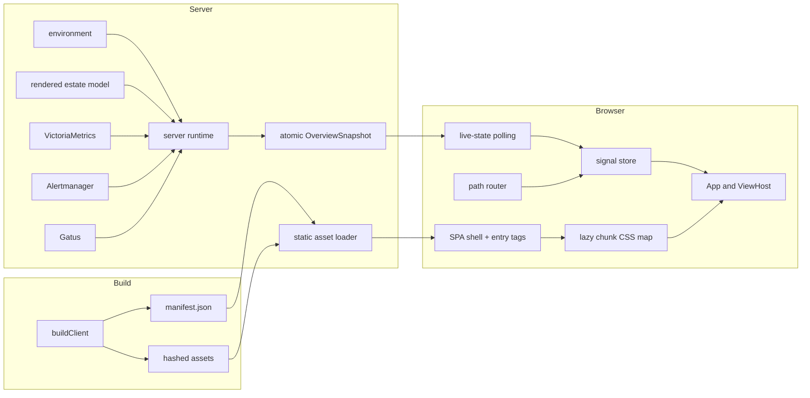
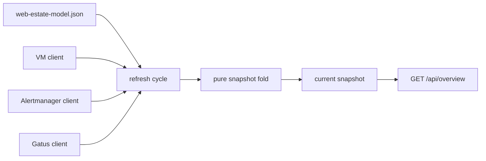

# Architecture

The web foundation separates build-time publication, server-owned estate state, browser-owned presentation state, and development-only composition. Each boundary has a small explicit contract, so later views can evolve without taking ownership of the build, transport, or server runtime.

## System Overview



The browser never contacts an engine directly. The server remains the owner of estate structure and live source aggregation; the browser owns only route, preference, selection, connection, and presentation state.

## Build and Publication Flow

`scripts/build.ts` performs three operations in order:

1. derive and write the application version;
2. call `buildClient()` for the browser bundle;
3. bundle the stable Bun server entry at `dist/server/index.js`.

`buildClient()` invokes `Bun.build` with splitting and hashed names, then classifies the metafile into:

```typescript
interface ClientManifest {
  buildId: string;
  entries: { js: string[]; css: string[] };
  chunks: string[];
  chunkCss?: Record<string, string[]>;
  inlineScriptHashes?: string[]; // CSP sha256 of each inline script in index.html
}
```

Before publishing, it validates asset-prefix, sourcemap, entry-count, flat-output, and chunk-CSS ownership invariants. The manifest is written to a temporary file and renamed into place, so a concurrent server read sees a complete old or new document rather than a partial write.

The build ID is deterministic from output basenames and excludes sourcemaps. Production cleans the client output first; development retains the last usable output when a rebuild fails.

## Manifest-Driven Asset Delivery

`loadStaticAssets()` loads the client directory into memory. In production it reads once because asset names are content-hashed and immutable. In development it checks manifest modification time on shell requests and asset misses.

For a valid manifest, `injectEntryTags()` adds:

- entry CSS before `</head>`;
- a `pulse-build-id` meta element;
- an inert `pulse-chunk-css` JSON island;
- a development marker when enabled;
- entry JavaScript before `</body>`.

The loader also exposes the inline-script hashes the shell's Content-Security-Policy allows; see [Security Headers](#security-headers).

Chunks and sourcemaps are served under `/assets/` but are not injected. If the manifest is missing, invalid JSON, or structurally invalid, the loader logs one fallback event and scans the directory for entry candidates. Operational routes remain available even with a damaged client build.

## Client Composition

`src/client/main.tsx` is the browser composition root:

1. read build and development markers from the shell;
2. create the signal store;
3. derive routes from the compile-time `VIEWS` registry;
4. create the path router and seed `store.route`;
5. start live-state polling;
6. render `App` into a React root (`createRoot`) and connect router changes to the store.

### Signal store

The store is a plain object of eager writable `@preact/signals-core` signals. There is no class or method layer. Components subscribe by calling `useSignals()` from `@preact/signals-react/runtime`; see [Web UI](../ui.md#pulse-deltas-from-deck). Snapshot, route, connection, preferences, selection, session, and future view payloads can notify independently.

`createHostSelectors()` installs one effect per store, fingerprints each host, and publishes only changed host slices. This avoids rerendering every host cell after a wholesale snapshot object replacement.

Theme and density use a guarded local-storage adapter. Storage probing, reads, and writes are failure-contained; unavailable or throwing storage leaves the store operational with in-memory defaults. Kiosk mode forces wallboard density and suppresses density writeback.

### Live state and reload coordination

`startLiveState()` adapts the existing snapshot poller into `store.snapshot` and `store.connection`. Polls are chained rather than overlapping. The latest good snapshot remains visible during failures, and the connection becomes stale only after the configured window.

The returned `reloadOnce()` is shared by three paths:

- snapshot application-version skew;
- the development build-ID check;
- unrecoverable lazy-view loading.

A single-fire guard prevents reload loops. Development tabs poll `/__dev/build-id` every second only when the shell contains a build ID.

### Routing

The path router owns browser location and writes resolved matches to the store. Static segments match case-insensitively, parameters preserve case and decode once, and the first declared route wins.

Legacy `#/path` locations are replaced with path URLs. `kiosk` and `rotate` query values carry into targets that do not set them. Unknown paths replace to the configured fallback, avoiding Back-button loops. `/api/`, `/assets/`, `/healthz`, and `/metrics` are never claimed as SPA navigation.

The router intercepts only ordinary same-origin left-clicks. External, modified, hash, download, target, and reserved-path links remain browser-owned. A same-document fragment link (`#section`, or the current path and query plus a fragment) is also left to the browser, which scrolls, sets `:target`, and fires `hashchange`. The router first saves the current scroll offset on the outgoing entry so Back restores it.

A `#fragment` survives in-app navigation. An intercepted link names its whole URL: its fragment ends up in `location.hash`, and a link without one clears the current fragment. For `navigate()`, a target's own fragment wins. A same-path target that names no fragment (a view rewriting its query state) keeps the current one, a bare trailing `#` clears it, and a different path drops it. Fragments are not part of the route match, so a fragment-only change does not re-render. Any push with a fragment lands on its target. On the page already rendered it scrolls there at once. Otherwise it starts at the top and retries each frame for up to a second while the new view renders, then gives up and stays at the top. On Back/Forward, an entry with a saved offset restores it, and an entry without one scrolls to its fragment target the same way.

### Lazy views and styles

Each `ViewDefinition` lazily resolves a React component. `ViewHost` begins one stylesheet-settlement promise for the active view and awaits it alongside every module-load attempt. It retries the module once, then records a build-specific session mark and requests one shared reload. A repeated failure for the same build clears the mark and renders an announced error state. A render error inside a loaded view degrades to a retryable page fallback (`PageErrorBoundary`, reset on view change).

The stylesheet loader reads the shell’s chunk-CSS island once per `Document`, deduplicates existing links, and resolves after each newly appended link emits `load` or `error`. Stylesheet failure is warned about but does not masquerade as module-load failure. Every Pulse style is Tailwind and compiles into the one entry sheet. The only CSS a lazy chunk imports is uPlot's, and the build omits chunk stylesheets the entry sheet already carries, so today `chunkCss` is empty (see [Web UI](../ui.md#pulse-deltas-from-deck)).

## Server Runtime

The production server retains the existing one-way estate flow:



The runtime fetches sources concurrently with independent failure capture, folds a complete immutable snapshot, and swaps it atomically. An optional runtime dependency bag can inject a fetch implementation and application-version provider; production uses global fetch and the built version.

Registered server routes receive a `ServerContext` containing the current estate, snapshot, typed source clients, and parsed configuration. `RouteDefinition.method` is the literal `"GET"`, enforcing the read-only extension seam at compile time.

## Security Headers

`src/server/security-headers.ts` owns every security header, and `createFetchHandler()` applies them to every response it returns, error paths included. The one exception is the dev-only `/__dev/build-id`, which the dev composition root answers before that handler. Nothing in the stack's compose files adds headers; the operator's reverse proxy should not either (see [Exposure](../../operator/exposure.md#security-headers)).

| Response | Headers |
|----------|---------|
| Every response from `createFetchHandler()` | `X-Content-Type-Options: nosniff`, `Referrer-Policy: same-origin` |
| HTML documents (shell, error page) | the above, plus `Content-Security-Policy`, `Cross-Origin-Opener-Policy: same-origin`, and `Permissions-Policy` disabling camera, microphone, geolocation, payment, USB, and motion sensors |
| SPA shell only | `Cache-Control: no-store`, because each response carries a fresh nonce |

`/assets/*` and `/api/*` get no CSP: a policy on a script, stylesheet, font, or JSON response does nothing when the response loads as a subresource. No HSTS is sent, because TLS terminates at the operator's reverse proxy, and HSTS belongs there.

The shell's policy, with the build's hash and the response's nonce filled in:

```text
default-src 'self'; script-src 'self' 'sha256-<inline script>'; style-src 'self' 'nonce-<per response>';
img-src 'self' data:; font-src 'self'; connect-src 'self'; object-src 'none'; base-uri 'none';
form-action 'self'; frame-ancestors 'none'
```

- **`script-src`** allows same-origin bundles and, by hash, the one inline script: the pre-paint theme/density stamp in `src/client/index.html`. The `pulse-chunk-css` island is `type="application/json"`, a data block the browser never executes, so CSP does not apply to it and it needs no hash.
- **`style-src`** has no `'unsafe-inline'`. Stylesheets are same-origin files. React, Radix positioning, and uPlot set inline styles through the CSSOM (`element.style`), which CSP does not govern. Three libraries create `<style>` elements at runtime, and each carries the response's nonce. The router stamps `<meta name="pulse-csp-nonce" nonce="…">` into the shell, and `main.tsx` passes the meta's `.nonce` property to `get-nonce`. react-remove-scroll's scroll lock, which every modal Radix dialog, sheet, select, and menu injects, reads `get-nonce` itself through react-style-singleton. The Radix Select and ScrollArea viewports each render their own `<style>` and take a `nonce` prop, which the vendored wrappers pass from `ui/lib/style-nonce.ts`. Browsers hide the `nonce` attribute from the DOM and from CSS selectors once the header applies, so the value is not readable through markup. A `style="…"` attribute in parsed HTML is still blocked.
- **`img-src 'self' data:`** allows data-URI images. **`font-src 'self'`** covers the self-hosted Geist files. **`connect-src 'self'`** covers `/api/*` fetches, the `/api/events` EventSource, and the dev loop's `/__dev/build-id` poll. The app uses no WebSocket, and dev and production share one policy.
- **`object-src 'none'`, `base-uri 'none'`, `form-action 'self'`, and `frame-ancestors 'none'`** close plugin content, `<base>` hijacking, off-origin form posts, and framing (clickjacking).

The estate error page has its own policy, `default-src 'none'` plus the hash of its one inline `<style>`. The hash is computed from the same constant that renders the page, so the two cannot drift.

### How the hashes are generated

`buildClient()` runs `inlineScriptHashes()` over `src/client/index.html` when it copies the file into the output, and records the result as `manifest.inlineScriptHashes`. `inlineScriptHashes()` hashes each inline `<script>` whose type is absent, a JavaScript MIME type, or `module`. It skips `src=` scripts, data blocks, and HTML comments, and it normalises CRLF to LF as the HTML parser does. Nobody maintains a hash by hand: edit the inline script, rebuild, and the new hash ships with the new bytes.

At load, `loadStaticAssets()` re-hashes the composed shell and compares it with the manifest. Production fails closed: the policy allows exactly the recorded hashes. If the shell drifted, for example because `index.html` was edited in `dist/` after the build, the loader logs `assets_csp_hash_drift` and the edited script is blocked rather than trusted. With no recorded hashes (an older build, or a malformed manifest that takes the directory-scan fallback), production allows no inline script. Development instead enforces the hashes of the shell it serves, so an `index.html` edit applies on the next rebuild, and logs the same drift line. Each shell response reads the HTML and its hashes from one loader snapshot (`shellDocument()`), so a dev rebuild can never pair one build's shell with another build's hashes. The manifest's `buildId` must be a short token (`[A-Za-z0-9._-]{1,64}`; the build emits 12 hex characters), and it is attribute-escaped where the shell interpolates it.

### Extending the policy

- **A new inline script in `index.html`** needs nothing: the build hashes it. Prefer a module under `src/client/` anyway.
- **A new third-party UI library** that injects `<style>` elements needs the nonce. Check whether it reads `get-nonce` (react-remove-scroll does) or takes a `nonce` prop, and pass `getNonce()`. Never add `'unsafe-inline'`.
- **A new origin** (an image CDN, a remote API) goes into the matching directive in `shellContentSecurityPolicy()`, with a test update. The browser only ever talks to this origin today, so think twice.
- **A new HTML page** rendered by the server should carry its own policy, as the error page does. `withSecurityHeaders()` never overwrites a CSP the response already set.

`tests/security-headers.test.ts` pins the exact headers per response type, the hashing rules, and, over a real build, that the served policy carries exactly the shipped inline-script hashes and follows an edited script on rebuild. `tests/browser/csp.test.ts` serves a production build and a development build through the production router in auth mode `proxy-header`. In Chromium it loads every route and tab in both themes and opens the command palette, the theme and density menus, a tooltip, the alert detail with its Silence and Acknowledge dialogs, the Expire confirm, the Propose edit dialog, the uPlot charts, and the mobile sheet. It asserts zero `securitypolicyviolation` events and zero CSP console messages. A positive control first proves that the capture sees a deliberate violation.

## Development Composition

`scripts/dev.ts` is a supervisor rather than an alternate application server. It performs the first client build, starts `src/server/dev/entry.ts`, and watches source trees:

- client/shared changes schedule a coalesced client rebuild;
- server/shared/version changes stop and restart the child;
- shared changes trigger both paths.

Only one client build runs at a time. Changes arriving during a build request one follow-up build. Server replacement waits for the prior child to exit, with a grace period before forced termination. A server restart does not alter the client build ID, so tabs resume polling without an unnecessary reload.

The dev child composes the same runtime, request handler, and asset loader as production. Development-only code stays unreachable from `src/server/index.ts` and the production client graph.

## Mock Engine

A mock scenario contains three wire-format fixture files and an optional timeline. `loadScenario()` validates fixture JSON through the real source parsers and fails fast for unknown or invalid scenarios.

`createMockEngine()` returns a fetch-shaped function routed by RFC 2606 `.invalid` origins and fixed source paths. It returns source bodies, a JSON 404 for unknown targets, or a rejected promise during a declared outage. No request can accidentally reach a real engine.

The timeline fold is pure and supports host up/down, alert fire/resolve, check pass/fail, and source outage begin/end operations. Gatus timestamps are rebased to the current clock while preserving authored age, preventing frozen fixtures from becoming unintentionally stale.

## Test Architecture

`describeDom()` controls happy-dom registration at suite scope, while `renderWithStore()` supplies a store and router for component tests. Component suites use React Testing Library through `tests/rtl.ts` and its `describeUi()` wrapper. A guard test enforces use of the DOM harness without requiring a global preload.

The browser harness builds isolated fixture pages for dark and light themes. CI provisions the Chromium revision associated with the pinned `playwright-core` version and sets `PULSE_REQUIRE_BROWSER=1`, converting a missing browser from a skip into a failure. Bundle budgets, dependency pins/licenses, production import isolation, dev-loop smoke, and manifest atomicity are also executable gates.

## Design Rationale

- **One build function** prevents production, development, and budget tests from drifting.
- **Manifest publication** makes code splitting safe and keeps stale outputs out of the shell.
- **Plain signals** provide narrow subscriptions without introducing a client framework layer.
- **Compile-time registries** keep extensions visible and deterministic; this is not a runtime plugin system.
- **Injected fetch in development** exercises production parsing and folding rather than maintaining a second fake server.
- **Last-good behavior** keeps the tool useful while code or upstream systems are failing.
- **Hashes from the build, a nonce per response** give a strict CSP without `'unsafe-inline'`, and leave nothing to update by hand.
