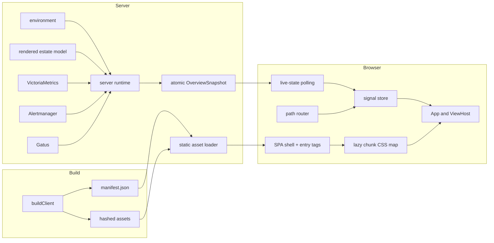
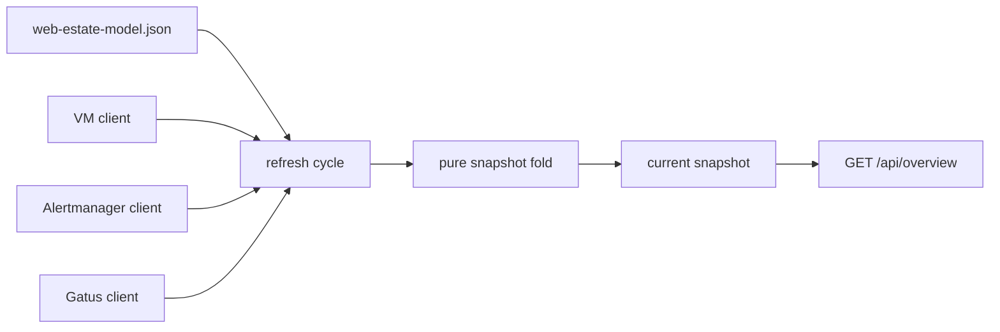

# Architecture

The web foundation separates build-time publication, server-owned estate state, browser-owned presentation state, and development-only composition. Each boundary has a small explicit contract, so later views can evolve without taking ownership of the build, transport, or server runtime.

## System Overview



The browser never contacts an engine directly. The server remains the owner of estate structure and live source aggregation; the browser owns only route, preference, selection, connection, and presentation state.

## Build and Publication Flow

`scripts/build.ts` performs three operations in order:

1. derive and write the application version;
2. call `buildClient()` for the browser bundle;
3. bundle the stable Bun server entry at `dist/server/index.js`.

`buildClient()` invokes `Bun.build` with splitting and hashed names, then classifies the metafile into:

```typescript
interface ClientManifest {
  buildId: string;
  entries: { js: string[]; css: string[] };
  chunks: string[];
  chunkCss?: Record<string, string[]>;
}
```

Before publishing, it validates asset-prefix, sourcemap, entry-count, flat-output, and chunk-CSS ownership invariants. The manifest is written to a temporary file and renamed into place, so a concurrent server read sees a complete old or new document rather than a partial write.

The build ID is deterministic from output basenames and excludes sourcemaps. Production cleans the client output first; development retains the last usable output when a rebuild fails.

## Manifest-Driven Asset Delivery

`loadStaticAssets()` loads the client directory into memory. In production it reads once because asset names are content-hashed and immutable. In development it checks manifest modification time on shell requests and asset misses.

For a valid manifest, `injectEntryTags()` adds:

- entry CSS before `</head>`;
- a `pulse-build-id` meta element;
- an inert `pulse-chunk-css` JSON island;
- a development marker when enabled;
- entry JavaScript before `</body>`.

Chunks and sourcemaps are served under `/assets/` but are not injected. If the manifest is missing, invalid JSON, or structurally invalid, the loader logs one fallback event and scans the directory for entry candidates. Operational routes remain available even with a damaged client build.

## Client Composition

`src/client/main.tsx` is the browser composition root:

1. read build and development markers from the shell;
2. create the signal store;
3. derive routes from the compile-time `VIEWS` registry;
4. create the path router and seed `store.route`;
5. start live-state polling;
6. render `App` into a React root (`createRoot`) and connect router changes to the store.

### Signal store

The store is a plain object of eager writable `@preact/signals-core` signals. There is no class or method layer. Components subscribe by calling `useSignals()` from `@preact/signals-react/runtime`; see [Web UI](../ui.md#pulse-deltas-from-deck). Snapshot, route, connection, preferences, selection, session, and future view payloads can notify independently.

`createHostSelectors()` installs one effect per store, fingerprints each host, and publishes only changed host slices. This avoids rerendering every host cell after a wholesale snapshot object replacement.

Theme and density use a guarded local-storage adapter. Storage probing, reads, and writes are failure-contained; unavailable or throwing storage leaves the store operational with in-memory defaults. Kiosk mode forces wallboard density and suppresses density writeback.

### Live state and reload coordination

`startLiveState()` adapts the existing snapshot poller into `store.snapshot` and `store.connection`. Polls are chained rather than overlapping. The latest good snapshot remains visible during failures, and the connection becomes stale only after the configured window.

The returned `reloadOnce()` is shared by three paths:

- snapshot application-version skew;
- the development build-ID check;
- unrecoverable lazy-view loading.

A single-fire guard prevents reload loops. Development tabs poll `/__dev/build-id` every second only when the shell contains a build ID.

### Routing

The path router owns browser location and writes resolved matches to the store. Static segments match case-insensitively, parameters preserve case and decode once, and the first declared route wins.

Legacy `#/path` locations are replaced with path URLs. `kiosk` and `rotate` query values carry into targets that do not set them. Unknown paths replace to the configured fallback, avoiding Back-button loops. `/api/`, `/assets/`, `/healthz`, and `/metrics` are never claimed as SPA navigation.

The router intercepts only ordinary same-origin left-clicks. External, modified, hash, download, target, and reserved-path links remain browser-owned. A same-document fragment link (`#section`, or the current path and query plus a fragment) is also left to the browser, which scrolls, sets `:target`, and fires `hashchange`.

A `#fragment` survives in-app navigation: an intercepted link or `navigate()` target keeps its own fragment in `location.hash`. A same-path target that names no fragment (a view rewriting its query state) keeps the current one, a bare trailing `#` clears it, and a different path drops it. Fragments are not part of the route match, so a fragment-only change does not re-render. It pushes an entry and scrolls the target into view. A new page's fragment is scrolled to on mount by `@/ui` `useScrollToHash`, which reads `location.hash`. On Back/Forward, an entry with a saved offset restores it, and a same-page fragment entry without one scrolls to its target.

### Lazy views and styles

Each `ViewDefinition` lazily resolves a React component. `ViewHost` begins one stylesheet-settlement promise for the active view and awaits it alongside every module-load attempt. It retries the module once, then records a build-specific session mark and requests one shared reload. A repeated failure for the same build clears the mark and renders an announced error state. A render error inside a loaded view degrades to a retryable page fallback (`PageErrorBoundary`, reset on view change).

The stylesheet loader reads the shell’s chunk-CSS island once per `Document`, deduplicates existing links, and resolves after each newly appended link emits `load` or `error`. Stylesheet failure is warned about but does not masquerade as module-load failure. Every Pulse style is Tailwind and compiles into the one entry sheet. The only CSS a lazy chunk imports is uPlot's, and the build omits chunk stylesheets the entry sheet already carries, so today `chunkCss` is empty (see [Web UI](../ui.md#pulse-deltas-from-deck)).

## Server Runtime

The production server retains the existing one-way estate flow:



The runtime fetches sources concurrently with independent failure capture, folds a complete immutable snapshot, and swaps it atomically. An optional runtime dependency bag can inject a fetch implementation and application-version provider; production uses global fetch and the built version.

Registered server routes receive a `ServerContext` containing the current estate, snapshot, typed source clients, and parsed configuration. `RouteDefinition.method` is the literal `"GET"`, enforcing the read-only extension seam at compile time.

## Development Composition

`scripts/dev.ts` is a supervisor rather than an alternate application server. It performs the first client build, starts `src/server/dev/entry.ts`, and watches source trees:

- client/shared changes schedule a coalesced client rebuild;
- server/shared/version changes stop and restart the child;
- shared changes trigger both paths.

Only one client build runs at a time. Changes arriving during a build request one follow-up build. Server replacement waits for the prior child to exit, with a grace period before forced termination. A server restart does not alter the client build ID, so tabs resume polling without an unnecessary reload.

The dev child composes the same runtime, request handler, and asset loader as production. Development-only code stays unreachable from `src/server/index.ts` and the production client graph.

## Mock Engine

A mock scenario contains three wire-format fixture files and an optional timeline. `loadScenario()` validates fixture JSON through the real source parsers and fails fast for unknown or invalid scenarios.

`createMockEngine()` returns a fetch-shaped function routed by RFC 2606 `.invalid` origins and fixed source paths. It returns source bodies, a JSON 404 for unknown targets, or a rejected promise during a declared outage. No request can accidentally reach a real engine.

The timeline fold is pure and supports host up/down, alert fire/resolve, check pass/fail, and source outage begin/end operations. Gatus timestamps are rebased to the current clock while preserving authored age, preventing frozen fixtures from becoming unintentionally stale.

## Test Architecture

`describeDom()` controls happy-dom registration at suite scope, while `renderWithStore()` supplies a store and router for component tests. Component suites use React Testing Library through `tests/rtl.ts` and its `describeUi()` wrapper. A guard test enforces use of the DOM harness without requiring a global preload.

The browser harness builds isolated fixture pages for dark and light themes. CI provisions the Chromium revision associated with the pinned `playwright-core` version and sets `PULSE_REQUIRE_BROWSER=1`, converting a missing browser from a skip into a failure. Bundle budgets, dependency pins/licenses, production import isolation, dev-loop smoke, and manifest atomicity are also executable gates.

## Design Rationale

- **One build function** prevents production, development, and budget tests from drifting.
- **Manifest publication** makes code splitting safe and keeps stale outputs out of the shell.
- **Plain signals** provide narrow subscriptions without introducing a client framework layer.
- **Compile-time registries** keep extensions visible and deterministic; this is not a runtime plugin system.
- **Injected fetch in development** exercises production parsing and folding rather than maintaining a second fake server.
- **Last-good behavior** keeps the tool useful while code or upstream systems are failing.
